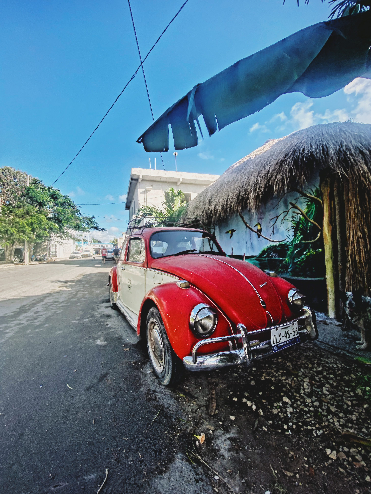

# 2020: Year in Review

In the spirit of personal transparency and accountability, here's the end of the year review! Well, selfishly and specifically, **my** end of year review. For a worldwide EOR I can't recommend the [New York Times Year in Pictures](https://www.nytimes.com/interactive/2020/world/year-in-pictures.html) piece enough, as that paints a very thorough, comprehensive and honestly brutal picture of the world in 2020. But as I've been learning for the past 4 or 5 years or so, writing my own perspective of my own year is an incredibly cathartic, mindful process that helps me to get my brain on track.

And what a year it was.

1. [Personal Life](#personal-life-)
2. [Professional Life](#professional-life-)
3. [Side Projects](#side-projects)
3. [In Fitness](#in-fitness-♂%EF%B8%8F)
4. [Travel](#travel-%EF%B8%8F)
5. [Reading](#reading-)
7. [Best Purchases](#best-purchases-)
8. [Gaming](#gaming-)
9. [Favourite Thoughts](#favourite-thoughts-)
10. 2021

## Personal Life 🥂

If there's one aspect where 2020 was a good year, all things considered, it was certainly in personal relationships. I feel incredibly lucky, grateful and proud to have spent a hassle, conflict-free pandemic year with my beautiful partner. I know of other couples who unfortunately weren't so lucky, and I understand why that was so — harsh lockdowns and spending 100% of the time with someone else can literally be "too much of a good thing".

Early in the year, we bought a place together in the Old Port of Montreal, and moved in in June. Buying property was by far the wildest and most daunting task I've ever undertaken in my life. Especially as a temporary worker in Canada, where my status is still tied down to a piece of paper, this had (and still does) some personal risk. But having taken it with my partner made it feel so much safer; like we could take on the world together if things went awry.

View from our rooftop terrace the night we moved in.

Last week, another incredibly big happening took place: we got married 🎉. Right in the middle of our second lockdown. That meant a ceremony of only four people: also only a couple of hours spent outdoors in the freezing cold, celebrating. But I couldn't be happier with our decision to end 2020 on a romantic and loving note. I'm very grateful to have her by my side.

The Old Port, during the Summer.

I could also talk about the year in politics and social change, and what I've learned and what that meant for me, but I won't do this here. While advocating for BLM and awareness on systemic racism, I lost friends to heated conversations, lost revenue on my newsletter, was virtually harassed and followed. But I wouldn't trade any of this for non-action, and I'm glad the tough conversations needed to happen.

## Professional Life 👨‍💻

When the lockdown hit in Montreal, which was earlier than in most places around the world, my worst nightmares seemed like they were about to come true: the remote life was about to kick in.

For context, the whole reason I'm in Canada right now, working for Shopify, is that in 2017 I called it quits with working remotely; I gave up a wonderful remote job while in Berlin, mostly due to the fact that I couldn't stand not having colleagues / a work life around me. Plenty of discussions with my therapist led me to make drastic changes; and I ventured across the ocean in hopes to find a wonderful work life at Shopify, which I did.

In early March, Shopify announced the closure of the office for at least 4 weeks. I remember thinking that I couldn't possibly withstand the heaviness of working from home for a whole month...! (How silly does that sound now in retrospect?) Despite being a hardcore introvert, I already knew that I absolutely needed to be around other people, for the same reason that when I was working remotely 2014—2017, I was doing so from cafés and co-working spaces — never from home. Video meetings drain the living soul out of me.

**Shopify soon announced the plans to go fully-remote forever**, and those news broke my heart and my mental health for a good, long stretch of time. Even today, it feels bitter and somewhat of a dark acceptance. How could I ever withstand working from home for even longer than planned? 3 months in and I hated it as much as I thought I would. Soon I realized that I wasn't really "working from home", but rather, "working during a global pandemic", which are two completely different things.

Like you, I've also forcefully learned about how to do work during a global pandemic, when very often the feeling of impending doom is greater than the motivation to write a good algorithm. There are still bad days; but I've gotten better at *not* pushing through work and stepping aside instead if I need to.

Despite it all, later in the year, I got the sweet news I've been working towards for almost 3 years; I was promoted to Senior Web Developer 🎉 I am still enjoying the front-end craft in 2020 and I'm still hungry to continue pursuing more technical excellence.

## Side Projects 💼

A poor year for side-projects of any kind. Motivation was out the window with the first lockdown, and the desire to spend even more time in front of a screen only diminished more and more as the year went by.

The only side project I maintained was my Typography and Coffee newsletter, [Coffee Table Typography](https://www.getrevue.co/profile/coffeetabletypography), which made regular appearances all year round. While I'm still enjoying writing them, they're being sent out less and less frequently, as each issue takes me about 6 hours of research and writing. On [Patreon](https://patreon.com/coffeetabletype), where a few amazing people support my work, I've received around $380 in support of the newsletter, which definitely pays for hosting, the platform fees, and 3 lattes. I've written 6 issues this year, 4 less than 2019.

## In Fitness 🏃‍♂️

### The Running Year

Old Port in the snow. My favourite for running.

If you know me even a little, you'll know that overall fitness plays a huge role in my life; mainly running and rock-climbing. And as far as 2020 is concerned, as you can imagine, there were bad news and good news.

2020 was a stellar year for running as a habit and overall volume, but not so much so in terms of improvement. Virtual races really didn't cut the mustard for me, as I could never find the motivation to push past 90% effort on any race. My best half-marathon and 10k times were both 5% slower than last year's times. Nevertheless, I was still able to push through a `1:31:04s` half marathon in April.

Still, this year I was *so close* to running 2000km, and I'm beating myself up for not having pushed hard enough with mileage. As of December 24th, these are my running stats:

| Distance | Time | Elevation |
|:--|:--|:--|
| 1855km | 156h | 12,338m |

I did however, take on the **Everest Challenge** in September, since I hadn't gotten much elevation this year since I moved away from the Mont-Royal mountain. After so many trail runs, 3 months later I did complete the `8,849m` of elevation, which I was very proud of.

Mont-Royal in May. Colder than it looks.

### Climbing 🧗‍♂️

As for rock-climbing, well, given that I mostly climb indoors, I got to climb only during the summer when the climbing gym was open. It was great to guarantee that I still maintained my strength, but no improvements of any kind. Hoping to get back on it in 2021.

### Cycling

2020 was also the year of (more) cycling for me. Before, I mostly biked as a way of commuting during the summer and the fall (let me remind you that Montreal has snow on the streets 6 or 7 months of the year). But having moved in the summer to the Old-Port area, with access to more biking paths alongside the water, my mileage also increased for these leisurely rides, most with my partner who also got into biking.

Recently, I also purchased an indoor bike trainer, a [Wahoo Kickr Core](https://www.wahoofitness.com/devices/bike-trainers/kickr-core-indoor-smart-trainer), on which I mounted my Echo Creme Solo bike. I've finally been going on longer (virtual) rides on Zwift, and I'm loving the new challenges of being an amateur rider. I'm truly excited about the possibility of long rides in the winter, even if indoors (so much podcasting time!)

There are the cycling stats as of December 24th. Not impressive by any standard, but certainly higher than last year:

| Distance | Time | Elevation |
|:--|:--|:--|
| 850km | 46h | 4,768m |

With the longest ride having been `44km`.

## Travel ✈️

Lol 😂

I was lucky enough to have my winter break in February, in Tulum, Mexico, right before the virus made its way across the world. It seems now like such a distant past — but this was the only trip outside of Quebec I've done all year. I can't fathom the idea of getting on a plane any time soon.
Plans were aplenty: Portugal in May to see family, a wedding in Italy in the summer, seeing more of Canada in the fall. All of these things were, of course, the target of a very heavy "put a pin on it".

A sunny adventure in Mexico in February.

Apart from a small weekend getaway in the summer to a cottage near Val-David, there was nothing in store for us. But would you look at this lake?

## Reading 📚

One would think that I read so much more this year, given you-know-what, but turns out some activities have gotta give when you spend all of your time running, biking, looking at furniture online, and contemplating the doom of civilization. I'm writing another separate review of my books of 2020, but here's a list of everything that I've read this year:

- The Pocket Thich Nhat Hanh, by **Thich Nhat Hanh**
⭐️⭐️⭐️⭐️⭐️

- Before the Coffee Gets Cold, by **Toshikazu Kawaguchi**
⭐️⭐️⭐️⭐️

- The Innovator's Dilemma, by **Clayton M. Christensen**
⭐️⭐️

- The Art of Racing in the Rain, by **Garth Stein**
⭐️⭐️⭐️⭐️

- Maps and Legends: Reading and Writing Along the Borderlands, by **Michael Chabon**
⭐️⭐️⭐️⭐️

- A Incrível História Secreta da Língua Portuguesa, by **Marco Neves**
⭐️⭐️⭐️

- The Well of Lost Plots (Thursday Next #3), by **Jasper Fforde**
⭐️⭐️⭐️⭐️

- Confessions of a Public Speaker, by **Scott Berkun**
⭐️⭐️⭐️
- The Making of Prince of Persia: Journals 1985-1993, by **Jordan Mechner**
⭐️⭐️⭐️

- The City We Became, by **N. K. Jemisin**
⭐️⭐️⭐️⭐️⭐️

- Anatomy For Runners, by **Jay Dicharry**
⭐️⭐️⭐️⭐️⭐️

- Invisible Women, by **Carolina Criado Perez**
⭐️⭐️⭐️⭐️⭐️

- Lost in a Good Book, by **Jasper Fforde**
⭐️⭐️⭐️⭐️

- Dead Astronauts, by **Jeff Vandermeer**
⭐️⭐️

- Illusions, by **Richard Bach (re-read)**
⭐️⭐️⭐️⭐️⭐️

- Where Good Ideas Come From, by **Steve Johnson**
⭐️⭐️⭐️⭐️

- The Eyre Affair, by **Jasper Fforde**
⭐️⭐️⭐️⭐️⭐️

- O Aviador, by **Jose Correia Guedes**
⭐️⭐️⭐️⭐️

- Just My Type, by **Simon Garfield**
⭐️⭐️⭐️⭐️⭐️

- La Collectionneuse, by **Pascal Girard**
⭐️⭐️⭐️⭐️

- Daniel's Running Formula, by **Jack Daniels**
⭐️⭐️⭐️⭐️⭐️

- A Year in Provence, by **Peter Mayle**
⭐️⭐️⭐️⭐️

There are certainly a few highlights worth mentioning. **The City We Became** by _N. K. Jemisin_, was a fascinating urban fantasy read like no other I've read before; Jemisin's unique voice and perspective of what it means to be a New Yorker hit all the right notes, and it's easy to see how she received 3 Hugo Awards in a row for her fiction storytelling.

Another book highlight from this year is [Invisible Women](https://www.goodreads.com/book/show/41104077-invisible-women) by Caroline Criado Pérez, a book that can arguably be defined as a social movement for Feminist justice, but even then is so much more than that. This is one of those books that should now be considered a mandatory read for just about anyone remotely interested in gender equality, and much more so if they work in any area related to design or research of any kind. We are, effectively, murdering women and paying the price for it, and this book reads like an angry depiction of how exactly we are doing so.

## Best purchases 💰

What _haven't I_ purchased this year? Moving from a rented apartment (pre-furnished) into a new, empty, bigger apartment, made me finally purchase everything a human being needs to live. This was the 28th time I moved.

However, here are a few things that made my life easier, better, or more fun this year:

- [Rapha Deep Winter Baseblock Layer](https://www.rapha.cc/ca/en/shop/mens-deep-winter-windblock-base-layer/product/IBL01XXBLK)

I think I featured this piece of clothing in my year in review 2017, and having worn that out to the point of destruction, here it is again. This is by far the best piece of clothing for winter running I've ever owned, despite the whopping $240 CAD price tag. Yes, it's meant for cycling, but that doesn't mean it doesn't lend itself well to running. The base layer alone keeps me warm down to -8ºC, and with another layer or two, the Canadian -20ºC running winters are _a breeze_.

- [Nike Pegasus Trail 2 Goretex](https://www.nike.com/ca/t/pegasus-trail-2-gore-tex-trail-running-shoe-JDT8pZ)

One more running item, for good measure. Having owned the original Pegasus Trail late last year, I was slightly disappointed by how much it felt like a hybrid road shoe. The Trail 2 Goretex have been pure, absolute delight on the trails this year; ankle support is finally good enough for the twisty mountain bends, and the Goretex layer makes sure your feet are also pretty darn dry in the snow. What an epic versatile shoe.

- [Zwift membership](https://www.zwift.com/ca)

And while I'm at it, the [Kickr Core](https://www.wahoofitness.com/devices/bike-trainers/kickr-core-indoor-smart-trainer) bike trainer I got to use it with. I was never a fan of indoor bike trainers. I owned a basic, $300 Tacx Blue earlier last year that I barely ever used; the rolling mechanism was too loud for an apartment, and it wasn't any joy to use. A direct-drive trainer is by far more expensive, but also 80% less noisy, more pleasurable and realistic to use, as it replaces the rear wheel of you bike entirely.
I've been using Zwift since the streets of Montreal became unbikeable, and having used it already for nearly 500km, I'm incredibly satisfied with the Zwift riding experience. It's also insanely fun with friends, as it allows you to ride with people of different levels at the same time by adapting resistance individually.

- [Manitobah Moccasins](https://www.manitobah.ca/collections/moccasins)

My oh my, has my pandemic cozy game been strong after purchasing a pair of Canadian-made, soft and fuzzy Moccasins. They're also a 100% **Indigenous-owned company**, and all their profits go towards building better communities for the Indigenous people. And trust me, the cozy game is strong with these ones.

## Gaming 🎮

I've never been much of a gamer. In 2019, I must have played a total of 12 hours. In March of this year however, I splurged on a **PS4**, hoping that I would play more often and that would make the lockdown time a bit more fun.

It _sort of did_. I've played a handful of games, but only completed one that I absolutely loved, **The Last of Us**. Of course, it's not big news to anyone who's into gaming, as the game has been around since maybe 2014...? Anyway, despite taking place in a post-apocalyptical, post-pandemic world, it provided such an engaging and well-crafted storyline that truly got me hooked. It was a joy to play, and a welcome distraction.

Another fun one to play together as two players was **Unravel 2**, a charming (but challenging) co-operative platformer where two anthropomorphic balls of yarn need to make their way across a dangerous human world.

But the real highlight, one which I spent 60 hours _playing_, has to be **X-Plane 11**. Yes, it's more of a simulator than a game per se, but this _game_ has changed my life in lots of different ways. Allow me to tell you why.

Flying the Cessna 172 in Xplane taught me so much about aviation

For the past 10 years, I've been flying _a lot_. Combine the European lifestyle with cheap flights everywhere, with the ease of travel, with the expat life including several trips back home every few months, and you get 16 flights a year on average.
However, I'm also one of **the most nervous flyers** you'll ever encounter: maybe it's because I had never been on a plane until I was 21, or that my body really doesn't seem to deal well with heights (a reason why I became a rock-climber), but flying is a nerve-racking experience 10 out of 10 times.

In January, I bought [X-Plane 11](https://www.x-plane.com/), which is a competitor to Flight Simulator but happily runs on macOS, hoping that I'd learn a bit more about flying and become more comfortable. Fast-forward 11 months, and I'm on 60 hours played. Plus the countless hours of YouTube videos learning how to fly a Cessna 172, from startup, takeoff, flight management, and landing. It's been a beautiful experience, to learn more about the ins and outs of the flying world, from mechanics to planning.

While I haven't been on a plane after learning so much about them, my theory is that I'll be a lot more curious and involved with the flight itself, as opposed to the usual 99% of terror from takeoff to landing. I still have a very irrational fear of being on the air, and I don't think that is going away so soon, but I imagine that as an engineer, an active and curious brain will go a long way in helping me.

## Favourite Thoughts 🤔

In 2019, I filled dozens of pages of delicious, inspiring thoughts to come back two. This year, barely even 4 pages. But I'm still just as in love with these as when I first read them.

> Being right keeps you in place. Being wrong forces you to explore. Sometimes the noise is the signal.

(Steve Johnson)

> You wonder whether you climbed the wrong mountain.
But life isn't a mountain that has a summit, Nor is it -- as some suppose -- a riddle that has an answer. Nor a game that has a final score.
Life is an endless unfolding, and if we wish it to be, an endless process of self-discovery, an endless and unpredictable dialogue between our own potentialities and the life situations in which we find ourselves. By potentialities I mean not just intellectual gifts but the full range of one's capacities for learning, sensing, wondering, understanding, loving and aspiring.
If I may offer you a simple maxim, "Be interesting," Everyone wants to be interesting -- but the vitalizing thing is to be interested. Keep a sense of curiosity. Discover new things. Care. Risk failure. Reach out.
I can tell you that for renewal, a tough-minded optimism is best. The future is not shaped by people who don't really believe in the future. Men and women of vitality have always been prepared to bet their futures, even their lives, on ventures of unknown outcome.

(John Gardner)

> Whether you win or lose, that does not concern you. Your ability to carry the struggle forward is what concerns you.

> We judge ourselves by our intentions and others by their behaviour.

(Stephen M.R. Covey)

# 2021 ²

In December 2019 I made no goals or plans for 2020. In hindsight, that was a great year to skip all of the usual future planning, given the way the year turned out to be, but I would like to grab on to a little more future-thinking this time.

## 1. Stop being so bitter, man

Right now, I'm not very hopeful or optimistic about both people and the world out there. Throughout the year, I saw myself becoming slightly bitter about the state of the world and humanity as a collective. Just earlier today, I got angry at some people for not keeping any physical distance from me while ordering my coffee. It's harder and harder not to feel like I'm not judging others, and at least in this moment, there is not a lot of kindness or forgiveness towards strangers from my side. Nor there is optimism about people doing good for the world.

I'm not like this, and I don't like it. I'd like to create more space for tolerance and forgiveness towards strangers, and stop thinking about them as a potential threat who don't care about my safety or well-being. Right now, I'm on full-on survival mode and it's not a joyful place to be in.

Regardless of how 2021 works out for the pandemic, it would be amazing to find a way to counteract these feelings and get back to my calm, loving, caring self I usually am so proud of.

> It's hard to set goals, when they're so intertwined with hope.

## 2. Re-engage

Since remote work will still be a huge chunk of my life, I'd also like to re-fall in love with work, my craft and everything that comes with it, without worrying too much about my mental health while working physically alone.
I stopped all side-projects this year. Work itself was more than enough, but that means I haven't developed any new skills or fallen in love with something new and exciting, technically speaking.
Hopefully, next year, I'll manage to create a little space and gradually insert a few more hours of engaging side-projects in it.

This holiday season was spent 100% away from coding, hoping that I'll return to work early January eager to get my hands dirty again.

## 3. Get a vaccine. Hug everyone.

Speaks for itself, doesn't it?

## 4. Pay more attention to my health

I've had a few health scares this year, mostly things out of my control. As I write this, in fact, my body is complaining about a couple of issues that I'm just postponing on checking out based on nothing but fear. While getting a doctor to look at you properly isn't the easiest of tasks in Quebec, this shouldn't prevent me from asking for help and getting a diagnosis. I'd be a much saner man if I did this and sleep so much better at night. In January, I will. I promise.

## 5. Write more often

I think I've only written 3 blog articles this year; 2 technical, 1 non-technical. I'd love to write more often, publicly and privately. I used to have so many notebooks filled with thoughts, journal entries, quotes, and generally speaking monkey-brain thoughts down on paper. I didn't do much of that this year, as I was mostly trying to avoid sitting with myself.

It didn't do me much good, in the end, and I'd like to be more mindful of this next year.

