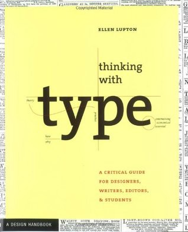
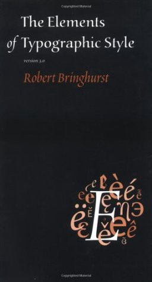
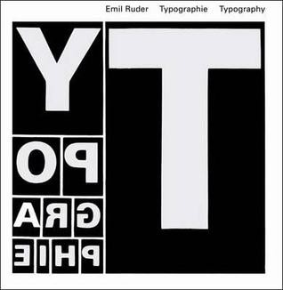
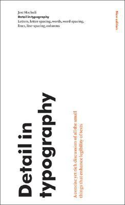
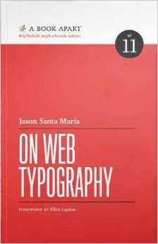
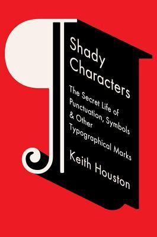
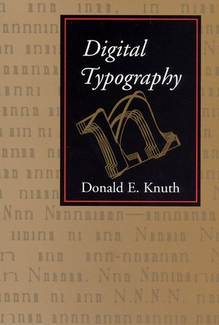
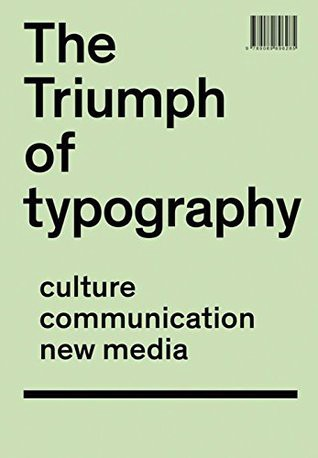

There is no _one book in typography_.

Typography entails an endless amount of disciplines and perspectives, and you’d be forgiven for finding certain aspects of typography… a bit boring. As an analogy, consider “learning about cars”. Great, but… classic cars? Supercars? Engines? The mechanics, or the design of Alfa Romeos in particular? Typography is similar: some disciplines won’t be your cup of tea, but there’s bound to be something so interesting to you about it that you’ll find yourself devouring knowledge like a hungry-hungry-typographic-hippo.

Maybe you’re a graphic designer who needs to get _the visual side of typography right for a project_; maybe you’re a content strategist who’s keen on learning _about the rights and wrongs of typography_ to get your message across more effectively. Or maybe you’re simply curious about the history of typography, or looking for a visually stunning coffee table book.

My goal with this list is to give you enough information from these books so you can pick which ones suit your interests, responsibilities and passions. This list has no affiliated links to buy books, either. I genuinely want to share the love of 📖 with you. Short and well curated lists are hard to find, so here’s my selection for different flavours of typography.

_If you’re not ready for a heavy book commitment on typography yet, that’s also fine—jump to the bottom of this article where I share online–based resources to help you get started._

---

#### 1\. Thinking with Type

by Ellen Lupton (2004) — [Goodreads](https://www.goodreads.com/book/show/69736.Thinking_with_Type) (4.06)

This is the book I keep recommending to everyone remotely interested in typography and/or graphic design. It’s also the one which sits on the higher levels of my bookshelf because I keep coming back to it every month or so. It serves as a gentle but practical introduction on _why typography matters_ and why you should care about it, as well as teaching you the best practices to show off your content without making a mess of your layout.

> Thinking with Type is divided into three sections: letter, text, and grid. Each section begins with an easy-to-grasp essay that reviews historical, technological, and theoretical concepts, and is then followed by a set of practical exercises that bring the material covered to life. Sections conclude with examples of work by leading practitioners that demonstrate creative possibilities (along with some classic no-no’s to avoid).

**Who is it for:** pretty much everyone. Both writers and designers and anyone interested in knowing more about how to use type will benefit from this little book.

#### 2\. The Elements of Typographic Style

by Robert Bringhurst (1999) — [Goodreads](https://www.goodreads.com/book/show/44735.The_Elements_of_Typographic_Style?from_search=true) (4.26)

Originally published in 1999, Robert Bringhurst’s book is like no other out there: he manages to combine the intrinsic details of typography as an art, as a designer’s craft and even as a cornerstone in politics and history.

It’s often considered the ultimate reference manual for type, but I think it’s way much more than that; the passion in Robert’s words make justice to the world of the printed word more than any manual ever could. From creating a backed-by-maths layout to explaining how font design works, this book will both please beginners and professionals in the field because there’s simply a lot and very broad topics in it. I can’t recommend it enough, and just writing this summary makes me want to re-read it all over again. In fact…

**Who is it for:** Just like the previous one, this book will please anyone whose work revolves around words in any shape or form. It’s a learning reference which doesn’t go too hardcore into the science of typefaces, but typography and its use in a more broad scope. Some consider it to be the Bible of Type. With less judgment, maybe.

#### 3\. The Anatomy of Type

by Stephen Coles (2012) — [Goodreads](https://www.goodreads.com/book/show/44735.The_Elements_of_Typographic_Style?from_search=true) (4.21)

**The Anatomy of Type** is not a broad introduction to typography; instead, it’s all about fonts (or typefaces, if you will). This is a book for those who already have been bitten by the typography bug and are looking for a manual to teach them how to better look and understand typefaces. It’s more of **a visual reference** than anything else, while breaking down the elements of what constitutes a good typeface and when to use them. Think of it as the equivalent of a field guide to looking at the stars and learn to understand them, because just like the stars, you’ll also want to stare at these pages again solely for beauty contemplation.

**Who is it for:** Most likely already established typography nerds who want to dive deeper into the world of typefaces. Also those who’d love to own a coffee-table book to randomly browse for inspiration on a Sunday afternoon.

#### 4\. Typographie =: Typography

by Emil Ruder (1982) — [Goodreads](https://www.goodreads.com/book/show/67269.Typographie_) (4.37)

_Typographie_ is one of those books that clearly has attempted to become a timeless classic on typography design. Not tying itself to any particular time, technology or skill, Emil’s classic is still the one of the _defacto_ manuals in many design schools since it was one of the first few to break conventional rules (and to reason about them) when it came out. Without the technology ties (it was first written in 1982), it does a wonderful job at going into the teachings of the foundations. From a [Goodreads review](https://www.goodreads.com/review/show/1377038282?book_show_action=true):

> …to such a clear and deep discourse on proportions, contrast, typographical shades, colour, rhythm and some more related techniques for setting type. This is a must and an eye-opener for anyone interested on Swiss and modernist Design.

**Who is it for:** While it covers the fundamentals, the book may be better suited for young designers whose craft will necessarily imply playing around with typography and layouts. Non-designers will benefit from the historical side of things and the practices, but the academic tone of this book may put some people off.

#### 5\. Detail in Typography

by Jost Hochuli (2008) — [Goodreads](https://www.goodreads.com/book/show/2318174.Detail_In_Typography) (4.42)

This little gem of a book is only 60 pages long, but that’s exactly what makes it great: it’s action-packed with great tips on how to enhance your content and optimise it for readability.

**Jost** is a master on designing books, so the book focuses a great deal on text setting in different environments and how they affect the reader (and also, how we read).

**Who is it for:** Anyone writing content and concerned about how to effectively deliver their message (hopefully, that’s every content strategist out there) will thrive on these words and practices. Here’s another Goodreads review:

> Hochuli starts at the lowest levels: how various marks make up a letterform, then how letters make up words, how words make up lines, and how lines make a column of text. All the while he points out how fine typography allows the readers eye to take in the text in the most efficient ways… and interestingly, that recent empirical research on reading seems to confirm the things fine typographers have always done.

#### 6\. On Web Typography

by Jason Santa Maria(2014) — [Goodreads](https://www.goodreads.com/book/show/13608106-on-web-typography) (4.42)

And we get into the Web world, at last! **Jason S. Maria** is no stranger in the Web design world and those who know him are certainly well aware of the impact his research on Web typography, both from a theoretical and practical approach, have had in the Web community in recent years.

Despite also covering some basics and fundamentals on how to master typography, this little book will serve best web designers and web developers alike. Both the initiated and non-initiated, will find tips on performance and how to get the little print details onto the radical new canvas that is the Web.

**Who is it for:** While most tips and practices apply to anyone working in the Web (not just designers and developers), these are definitely the ones who’ll benefit the most from this book.

#### 7\. Shady Characters

by Keith Houston(2012) — [Goodreads](https://www.goodreads.com/book/show/17573647-shady-characters) (3.9)

While not a book that will teach you how to master typography itself, **Shady Characters** is probably the book to skyrocket your interest in words, language, type, and damn it, life! This book is a beautiful and unique way to find out the true, deep and obscure stories behind punctuation and symbols in our alphabet(s). Do you know where the [paragraph came from](http://www.shadycharacters.co.uk/2015/07/death-of-the-para/)?

Or even, what’s the true story [behind the ellipsis](http://www.shadycharacters.co.uk/2016/10/miscellany-78/)? Keith is kind enough to share so much of his findings on his blog, which is more than a taster; however if you really want to get geeky about the fascinating origins of language, you absolutely can’t miss this book. I lick it, every now and then.

Here’s a review from Goodreads:

> This book was both a joy to read and quite enlightening. Not only was the writing engaging, but it did a wonderful job integrating the story of these various symbols into the context of the wider world of human affairs. While certainly intended for a popular audience, Houston took his task very seriously, drawing upon an enormous range of sources to tell the story of these symbols to the tune of ~67 pages of references

**Who is it for:** Arguably, people who’re either fascinated with languages and alphabets, or history in general. Keith isn’t afraid of digging deep into history, but he does so very eloquently. Plus, anyone who’s interested in coming up with the most intriguing trivia at the next dinner party in your neighbourhood. That’s a thing people do, right?

#### 8\. Digital Typography

by [Donald Ervin Knuth](https://www.goodreads.com/author/show/64941.Donald_Ervin_Knuth) (1998) — [Goodreads](https://www.goodreads.com/book/show/119197.Digital_Typography) (4.42)

If you recognise the name Donald Knuth, you’re not mistaken; the author really is the same world renowned computer scientist who wrote the epic [The Art of Computer Programming](https://www.goodreads.com/book/show/112239.The_Art_of_Computer_Programming). Donald once deviated from the world of computer science and ended up getting bitten by the word bug; Digital Typography is a timeless piece that explores the connection between computers and typography from the mindset of a different kind of designer. A designer that would eventually invent the [**TeX** type system](https://en.wikipedia.org/wiki/TeX) in 1978.

This is probably the book that will forever come the closest to an understanding of the connection between science and font design.

**Who is it for:** Without a doubt, the most tech-savvy readers will take the most pleasure out of this book as sometimes Knuth’s language is heavy on the mathematics.

_And… a sneaky, bonus 9th book because you’ve made it this far_ 🎈

#### 9\. The Triumph of Typography: Culture. Communication. New Media

by [Henk Hoeks](https://www.goodreads.com/author/show/5235057.Henk_Hoeks), [Ewan Lentjes](https://www.goodreads.com/author/show/14130412.Ewan_Lentjes) (2015) — [Goodreads](https://www.goodreads.com/book/show/26095079-the-triumph-of-typography?ac=1&from_search=true) (5.0)

This little extra book is meant for those who don’t necessarily fit in the designer or developer categories. Hoeks and Lentjes explore the impact of typography from a social and cultural perspective which is found nowhere else. How did typography in this increasingly digital world played a role in transforming how we consume and became the media?

The actual questions that the book pose are a good set-up for what the book provides:

> Typography rules the world, but in what way does a typographical text still form the fundamentals of public life in an era of digitalism and interactivity? In The Triumph of Typography a number of professionals investigate the cultural revolution caused by new media and digitalization.

**Who is it for:** Anyone interested in the broader scope of communication and digital media is sure to find this book fascinating, still keeping the emphasis on the impact of typography and its developments in recent decades.

---

### I don’t have time for books on Typography, Ricardo! What else can I do for free?

> _On words & history_

**Keith Houston**’s website, [**Shady Characters**](http://www.shadycharacters.co.uk/) (from the book with the same name) is one of the most fascinating resources on typography and languages out there. He has shared so much over the years and the comments on each article are probably the only place on the Internet where they’re actually insightful and a pleasure to read; a good indicator of the crowd he attracts.

> On fonts & design

If you’re a designer or a content writer who struggles to find the perfect pair of typefaces to use, search no more: Tim Brown, whom I dearly call the father of modern typography (modern as in today, this moment, this second) has recently made his [**Pocket Guide to Combining Typefaces**](https://blog.typekit.com/2016/04/29/combining-typefaces-free-guide-to-great-typography/) free to the public, after sitting on the shelves of Five Simple Steps.

> On Typographical Essentials

Famously known in the design world as the _“holy crap I can’t believe he’s giving this amount of information for free!”_, **Mathew Butterick** holds the title for the best, most comprehensive and practical free online guide to learn about, you’ve guessed it, [**Practical Typography**](http://practicaltypography.com/). It’s the most condensed but utterly complete guide to understanding typography as an art and as a tool. Aimed not just at designers but content strategists as well, so bookmark it, study it, love it, share the love.

While Mathew chose to leave behind the practical bits of the digital and technical world of web design, [Donny Truong](http://www.visualgui.com/) has done an epic effort at crafting yet another beautifully and knowledgeable guide to [**Professional Web Typography**](https://prowebtype.com/) that no one in the web design world should miss. Apart from touching on the fundamentals of type, Donny presents very clear and by-chapter best practices on how to deal with fonts on the web, how to put their features to best use and how to craft efficient UIs using type.

Not fond of courses or guides or books? Okay, here’s a last resource for you that comes in article form: the post that redefined the way we, in the web at least, look and think about it, [**More Meaningful Typography**](https://alistapart.com/article/more-meaningful-typography) by, once again, Tim Brown.

> On keeping up to date

If you’d like to keep up to date with whatever’s going on with the typography world, I’ve been curating a typography (and coffee!) newsletter for the past 6 months or so. It’s [**Coffee Table Typography**](http://ricardofilipe.com/coffeetabletype) and every two weeks I deliver a very short, curated list of interesting articles on languages, fonts, typography, books, and coffee. [24 editions](http://tinyletter.com/coffeetypography/letters/coffee-table-typography-24) so far, I’ve been loving curating these articles!

](./asset-10.png)

I also recently came across [Better Web Type](http://betterwebtype.com), an incredible _course-by-newsletter_ on practical typography for the web by Matej Latin. I’m extremely picky about the newsletter I subscribe, but I found Matej’s way of explaining the main concepts around type in a fresh, concise and inspiring way. I seriously 👏 at the work he’s been doing.

---

#### Wrapping up

Yes, I missed so many books on this list! I’ve tried to cover a little bit from the most common perspectives, but as with anything else, the key is to provide a non overwhelming introduction to the topic. Be sure to let me know about your favourite typography related books in the comments or on [Twitter](https://twitter.com/magalhini).

If you’re a book lover yourself, let’s be best friends on [Goodreads](https://www.goodreads.com/user/show/26866736-ricardo-magalh-es) 📘.

<Embed src="https://upscri.be/f51076?as_embed=true" aspectRatio={undefined} caption="" />
