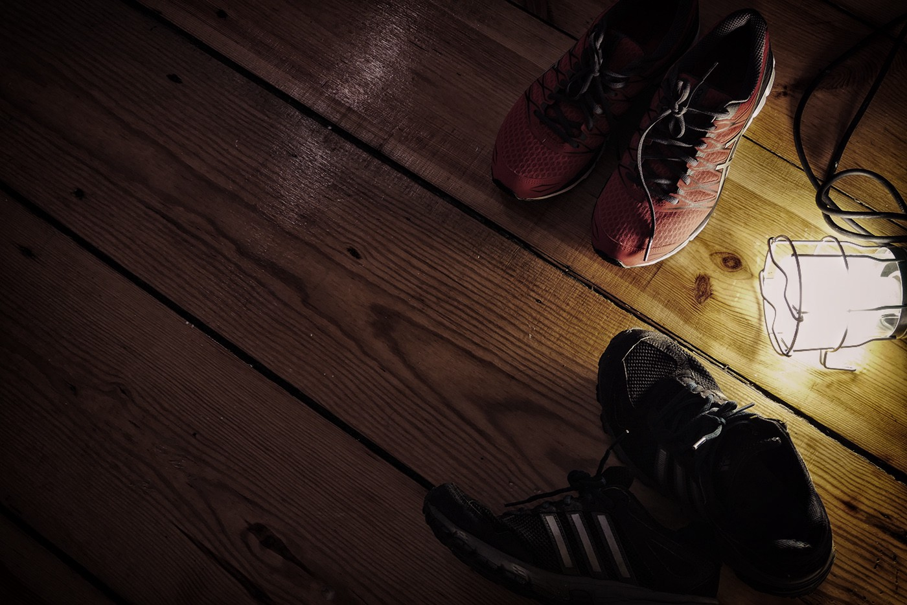

## _Today I bought new running shoes._

It was a long overdue mission, mind you: my running shoes, which have been traveling with me for (quite) a while, have shamefully more holes in them than I could count. But it wasn’t until I came home with those new, brand-spanking new shoes, that I realised they meant retiring these old ones… and that was a sad, almost distressful thought. So this is my _thank you, my ode_ to an old, rather cheap and beaten up pair of running shoes. Kind of like me, coming to think of it.

**I ran 2052km on these shoes.**

2052km. That’s 1275 miles. About the same distance from Paris to Athens. More importantly, and shameful, is that this is 4 times the maximum recommended distance for any pair of running shoes.

So I dug deeper into some more statistics I have logged… and suddenly the numbers became more than just numbers: they became **words**, a trip down memory lane. It’s been exactly **800 days** since I bought them in Aveiro (Portugal) where I used to live many years ago, just a week before I made a move to London. I remember buying them before the trip so I could immediately use them to run around whatever neighbourhood I landed at… and start exploring — with a curious mind and bursting lungs — a new city, a new country, a new life. No excuses; the shoes were there already.

Since then, they were my to-go shoes with every house move. With every country move… Each time I’d travel, I’d bring them with me for the same purpose: run around, get to know the place. More than just distance, the shoes **began ranking up memories**.

1.  I ran with them in **12** different boroughs of London.
2.  I ran with them when I brought them back home for a week of holiday, in **Porto**.
3.  On the idyllic **landscapes of Iceland**, I ranked a few miles with them a few early mornings.
4.  In **Turkey**, twice, in Kalkan and around the Lycian Way, where I ran my first trail.
5.  In **Chiang Mai**, running around the empty streets for a month at 6am before it got too hot.
6.  On a work and travel UK trip this year; using them as an excuse to get to know **Oxford** and **South Wales** a little better.
7.  In **Prague**, running my own, self-organised “bridges tour”. On my birthday.
8.  In **Berlin**, where they ran their first half-marathon, wrapped up in plastic bags because it was raining a lot and they had… well, many many holes.
9.  In Jordan, even after hiking the Wadi Rum desert for days on hiking boots, I still brought them to squeeze in a run, somehow.

So what to do with these retired shoes, now, then? Yes, I could keep around them for those occasions… you know, that day lake trip, going to the grocery store, taking the garbage out. But if I were a running shoe, is this really the destiny I’d like to end up having? Garbage trips? Wouldn’t I prefer to go out in a bang, after such a priceless portfolio of miles and memories? It would be like using Miles Davis’ trumpet to hang drying clothes in the living room.

> **You see, I am those shoes. Beaten up, but happy to have lived through more than just boring laps on a track.**

Whatever I end up doing with them, this thought is now deeply engraved in the back of the mind: this new pair, shiny and red, whether they last 2 months or 2 years, have a lot to live up to. So let’s rank up those memories.
