V_ietnam was, and still is, one of the places that heavily piqued my curiosity. The media, as well as most cinematic appearances, never really portrayed Vietnam outside of this unknown, almost unworthy of love country of conflict, always associated with this very misunderstood war. But I knew Vietnam was also home to something very different; gentle and forgiving souls, an incredible food scene from north to south, beautiful ethnic minorities everywhere and a handful of different kinds of gorgeous scenery, ranging from high mountains to paradisiac beaches._

This is the short-form (yes, short!) report of what I’ve experienced, seen and done exploring the north of Vietnam for almost two weeks, traveling slowly. Stay for the pictures, or to take away some itinerary ideas for your own trip.

_Side note: I’ve_ [_written a similar photo report_](https://medium.com/@magalhini/a-middle-eastern-journey-d577ee3372c4#.hcwjphvom) _of my Wadi Rum trip early this year, in case you’re also interested._

### The itinerary

The beauty of traveling solo is that you’re accountable for your own decisions. When it comes to the itinerary, you get to follow your instinct based on what feels right. I didn’t plan much apart from some initial research, so here’s the rough route I ended up doing:

> Hanoi (3 days) — Sapa (3 days)—Ninh Binh (2 days)—Bai Tu Long Bay (1 day)—Quan Lan Island (2 days)—Hanoi (2 days)

Most of these return journeys had to involve getting back to Hanoi for the night, so I ended up spending more time in Hanoi than I wanted. The challenge was to avoid most tourist traps (and tours in general), but still managed to meet a lot of wonderful travellers along the way with the occasional tour. Tours are actually the best way to meet people if you’re travelling solo, so don’t dismiss them just yet. If there’s one thing I learned from this trip, is that trying to avoid people is a pretty bad idea… they’re the ones who’ll make the trip memorable.

### Hanoi

Ask anyone who’s been there and you’ll probably get the same answer and the same look: **Hanoi is beyond intense**. Arriving at the Old Quarter on a Sunday night is pretty much like being shoved into a cement truck with 3 grizzly bears while listening to Russian trash metal in your earbuds. Rolling down a mountain, while set on fire.

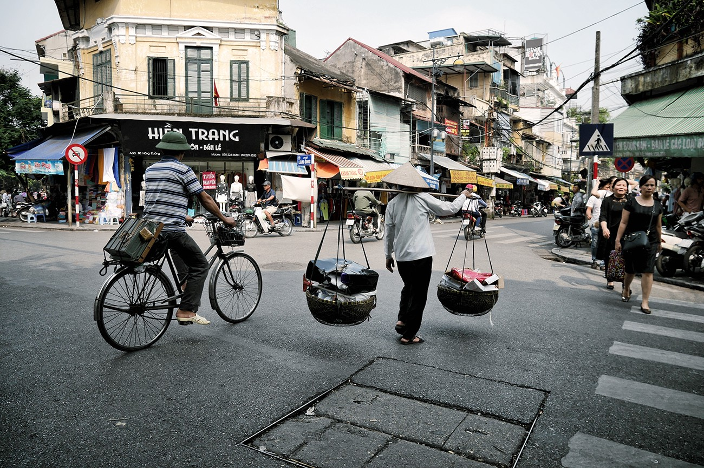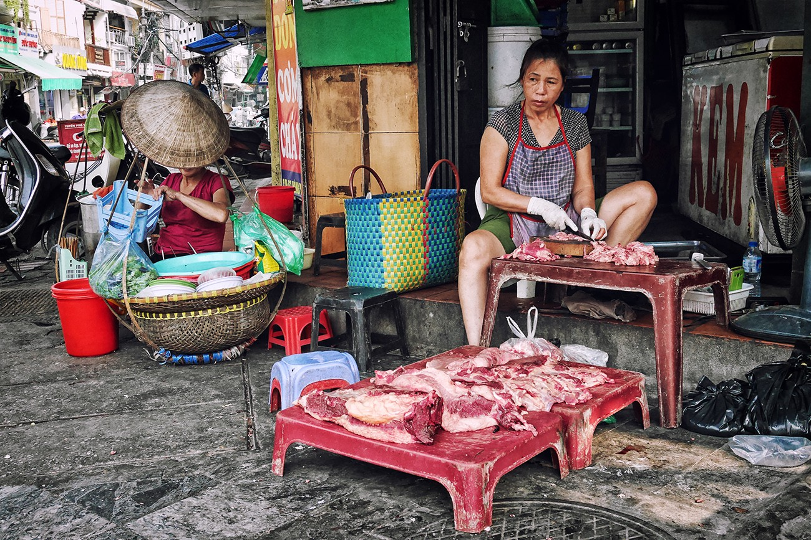

It’s beyond belief how much all of your senses are on full overload just by walking down the streets. Crossing the street, any street, is an epic and dangerous adventure, and even walking on the sidewalk doesn’t put you on the clear; you’re still risking being run over by the cheeky motorbike. The smells of fumes, food being cooked in every corner, they all intertwine with the intense loud noises of bikes and cars honking, people talking, and being harassed to buy something (usually food) from the street vendors.

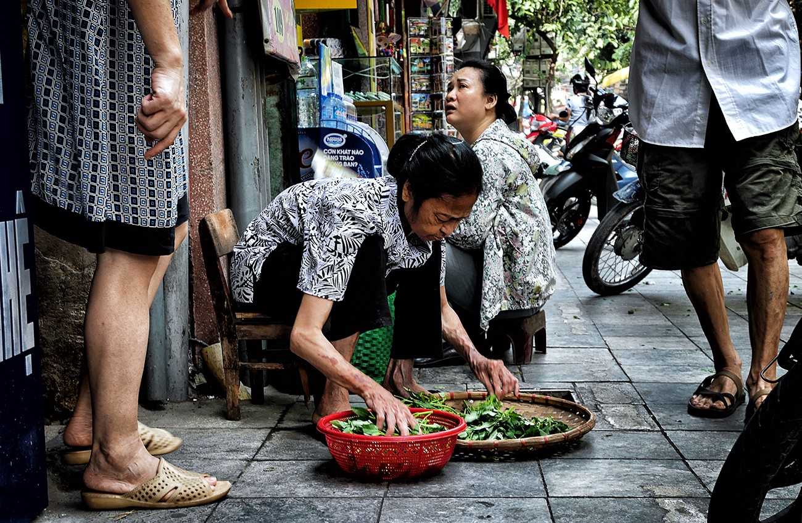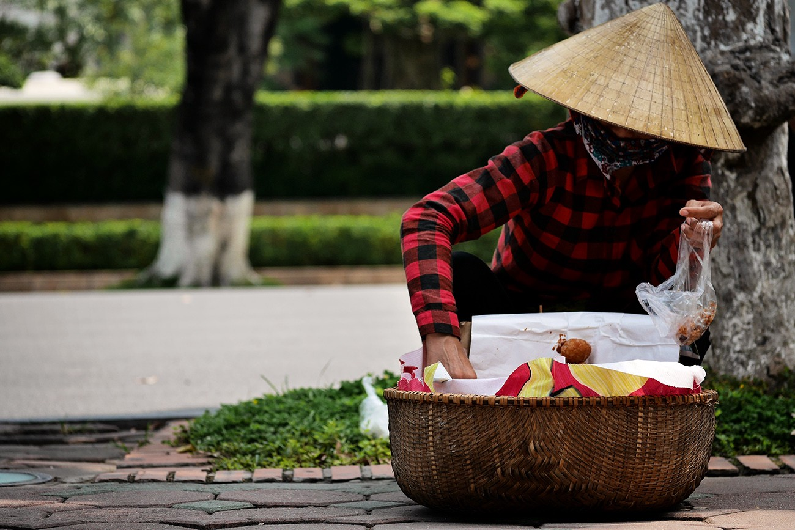

On that first night, jet lag was cured after twenty minutes just by walking around the Old Quarter. Being a weekend day, also meant that the night market was on, so it was busier, louder, more chaotic than usual. The market itself is thriving with life of all kinds and shapes.

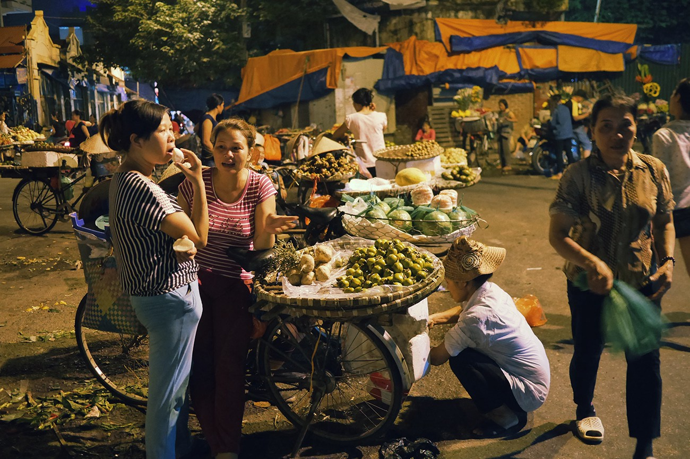

The next day, armed with my camera, 3 lenses and my Lonely Planet guide, I began exploring as randomly as I could. I immediately stumbled upon the **Hoàn Kiếm Lake**, probably regarded as the very centre of Hanoi itself. It’s incredibly scenic and thriving with all kinds of everyday life; locals love it probably even more than tourists. And speaking of tourists… it’s worth noting that even though the city lives for tourism as a business, it was surprisingly rare to see Western faces in the city, apart from the Old Quarter.

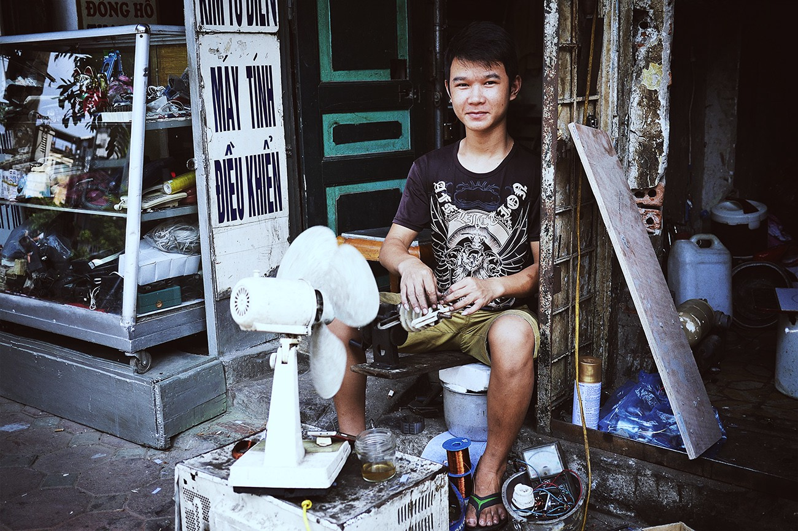

Looking into the lake, it’s impossible to miss the pretty **Ngoc Son Temple** right in the middle of it. On weekends this whole area around the lake is cut off from traffic, which means it’s actually a safe place to walk around and it’s the best spot in town for people watching. Families walk together, dads ride bikes with their kids, lovers sit down for ice cream, children rollerblade and sing songs in the streets… life happens beautifully.

But most of all, it happens effortlessly.

---

**Sidetrip: Perfume Pagoda**

On Mondays, most of Hanoi pretty much shuts down. No museums, no attractions. So I’d heard about this complex of temples and Pagodas a bit far off the city, called **Perfume Pagoda**, and since I wasn’t going to go sightseeing in Hanoi on a Monday, I decided to give it a go.

The journey takes a bit more than an hour, and the whole experience is a must do and see, in my opinion. The complex of pagodas can only be reached by boat, so you get to be on a boat rowed by insanely strong women for quite a while:

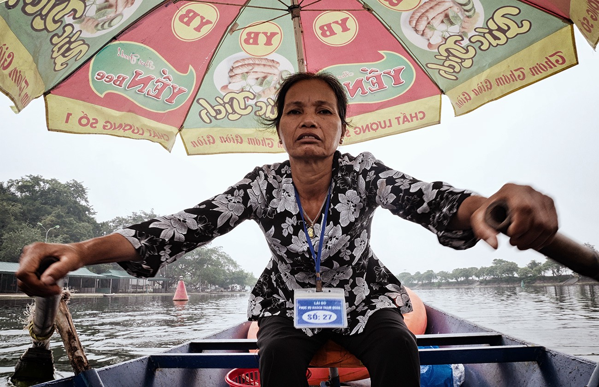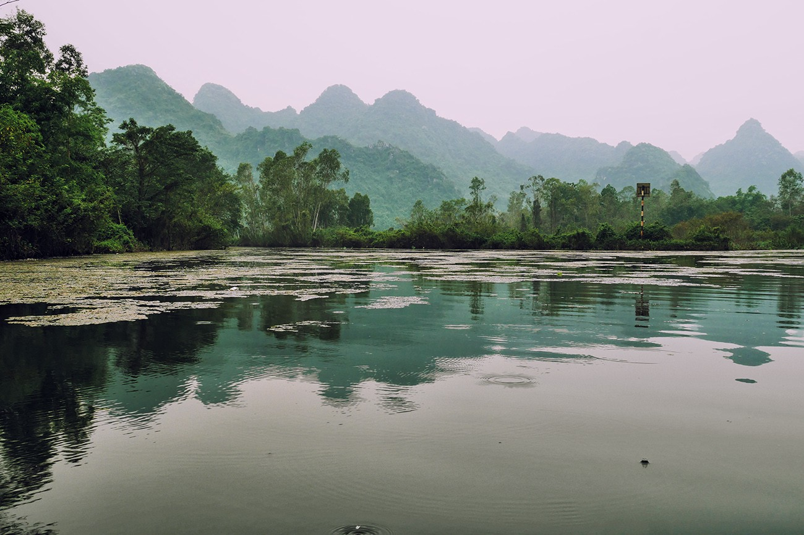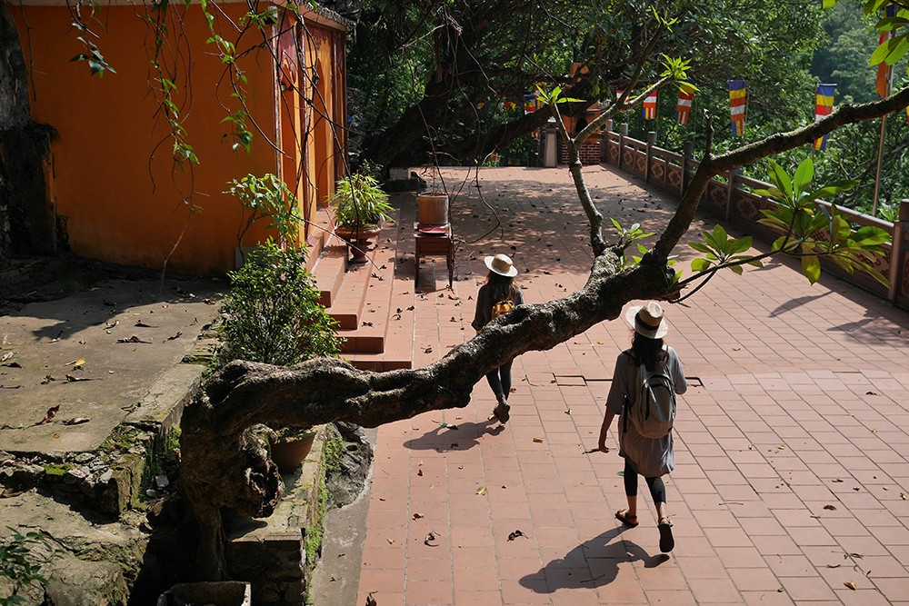

When you get off the boat, you have the option to either hike to the top or take a cable car. Before setting off, I met these two lovely Israeli girls, Yael and her friend, who were very keen on hiking all the way to the top. So the three of us set off on this little hike of ours.

_It’s remarkable to notice how much you get to know someone by hiking with them for a little while. Amidst the walking and the panting, no one’s afraid of asking questions as direct as “so who are you?” or “what’s your story?”. Under an hour, I felt like I had made two great friends that had so much to teach me._

Worth noting, we were the only people hiking this trail, that day. So if you can avoid that cable car… go for it.

---

Along the way, you get to see the pagodas and the temples, which have an incredible feeling of having being lost in time:

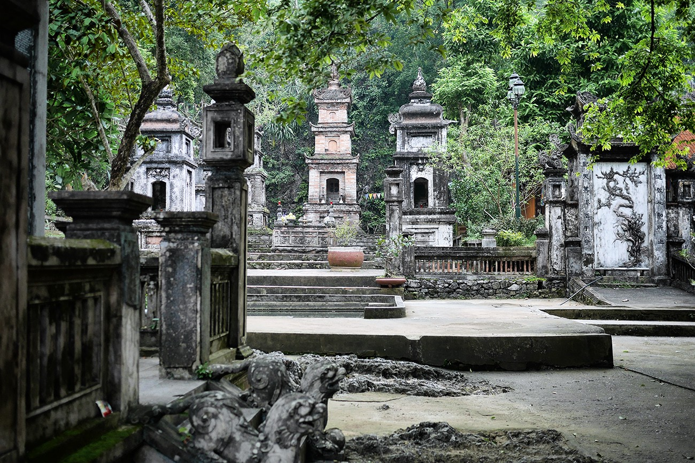

Once you reach the very top, you finally get to see what _this_ is all about. Peeking down through the staircase, you can feel the cold breeze of something… different. Other-wordly, almost. Immediately, I felt like I was thrown directly into an Indiana Jones movie. Here’s the entrance of the cave we were promised to reach:

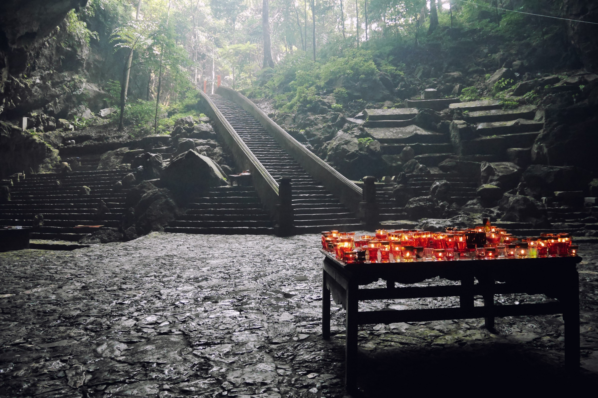

The prize at the end is the most beautiful, peaceful, and out of this world cave you’ll ever encounter. At the deep end of the cave, a small shrine was built in which you’ll get lost in thoughts, if you get to be the only one there. The sound of dripping water, bats, incense burning is everything you’ll hear, and it’s pure bliss.

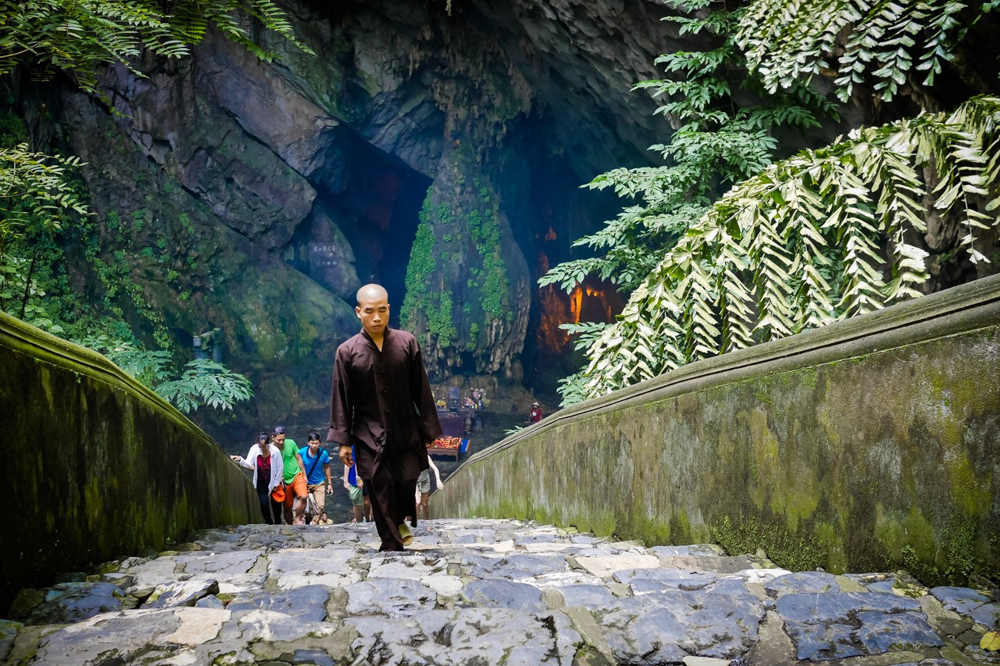

After making our way back to Hanoi, I booked my bus to **Sa Pa** for the next early morning. But not before I snapped a few more shots of the impressive Hanoi local life.

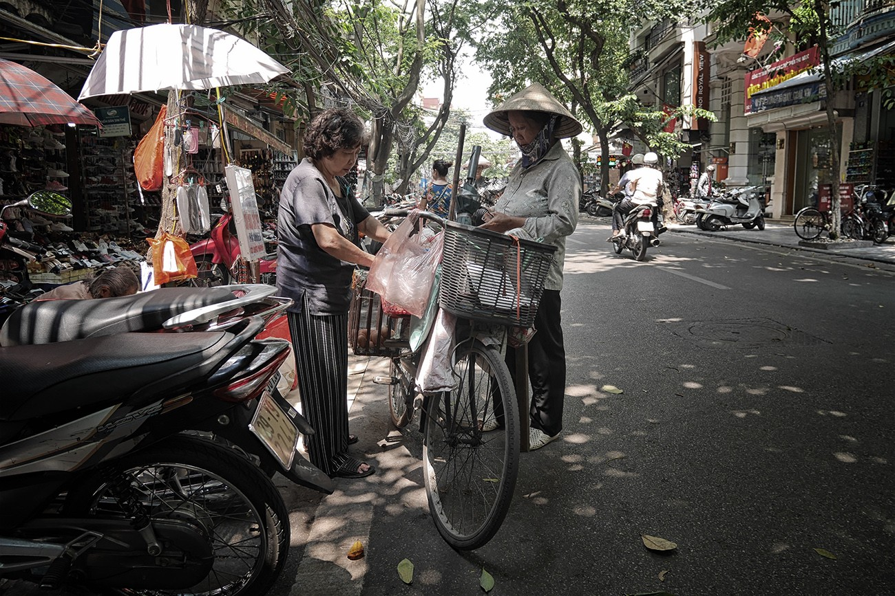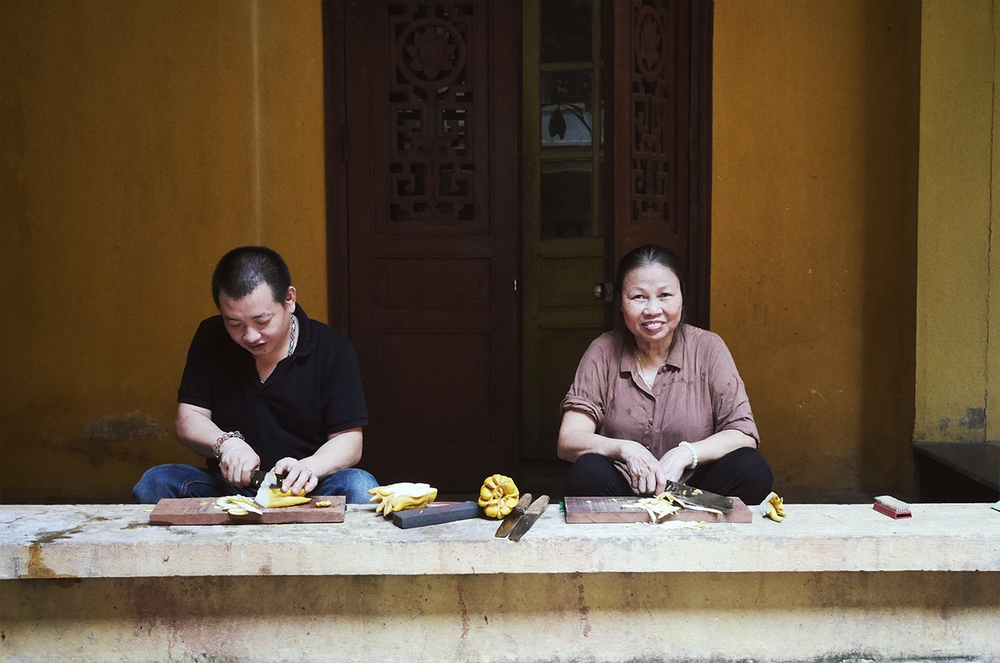

### On to Sapa

I boarded the **Sapa Express** bus early in the morning. The trip took about 6 hours and was surprisingly comfortable; these are sleeper buses who’ll gently nurse you to sleep for most of the way… until you reach Sapa. The paper bags you find in front of each seat? Yeah, they’re there for a reason. If you’re prone to car sickness, then probably the train is a better option for you, though this rough part of the journey only lasts for about 40 minutes.

The whole area of Sa Pa is quite near the Chinese border, a hill station town also known as the _Tonkinese Alps_. The pictures themselves explain why better than I ever could with words. Sa Pa is also home to several hilltribe minorities, the most famous being the Red Dzao and the Black Humong.

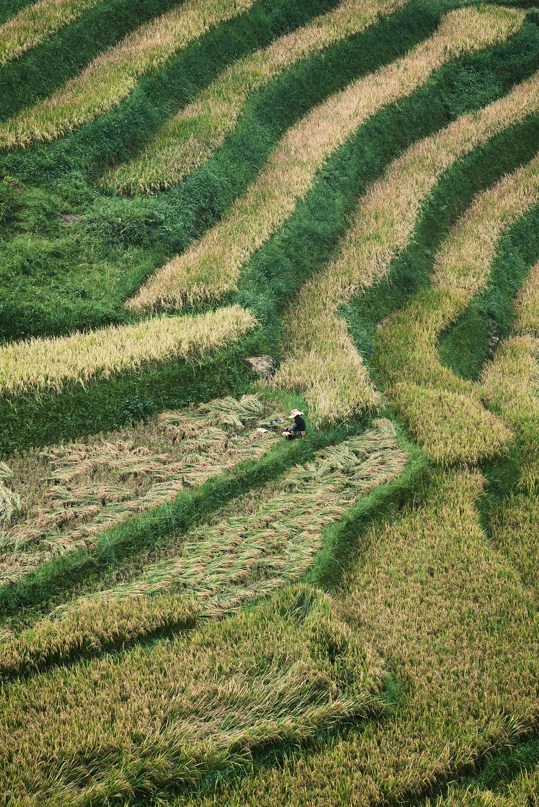

Unfortunately Sa Pa, at least the main town, has been massively hit by tourism. I was very happy **I wouldn’t be staying in the town itself:** touristy, with very little to do or see over there. It’s buzzing with cheap hotels, pubs and bars and small town restaurants. It serves merely as a hub to the surrounding villages, but honestly, **there’s no point in staying there at all**. I had a homestay booked in the village of **Ta Van**, nested deeply into the mountains inside Sa Pa, and I can only recommend you book a homestay on these villages as well. **Staying with a local family will give you the insight into the local culture that you just wouldn’t get otherwise.**

After negotiating the price with a taxi driver to take me there (get used to it), I had a taste of what _real Sa Pa_ was like; a cocoon of many ethnic tribes, each one very culturally different from the next, but sharing the same amazingly scenic mountain views filled with rice fields and water buffaloes.

The two days I spent in Ta Van, going from village to village, were very humbling. Each tribe is so different from one another, even though they’re only a few miles apart. Spend a couple of days there and you’ll learn how to recognise the Dzao from the Hmong from their clothes, as with other tribes. Regular life in the fields is as traditional as it gets, and I still find it incredible how most mothers can manage a full-on working day carrying their children on their back:

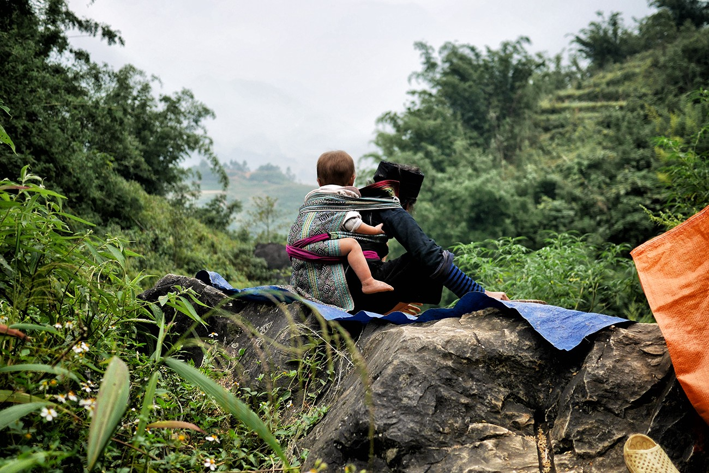

On the second day, I went for an **early morning run**. I always pack my running shoes, as I find that running is the best excuse to get to know a place (heck, I even [wrote about running shoes](https://medium.com/@magalhini/an-ode-to-a-pair-of-shoes-84b9d36317e6#.o1pfovrmy)!). At 6am, the sun was out and intense already, but being so high up in the mountains the air felt fresh enough for a 10k that I had planned on Google Maps the night before. Naturally, this plan went wrong, oh so wrong! Some of the paths I took in the mountain were un-walkable, and after so many turns I ended up getting lost. It quickly turned into a trail run, one in which you have no idea where you’re going and every turn is an opportunity to step on some glorious buffalo shit. On the bright side, it made up for some astonishing views that I would haver otherwise never found.

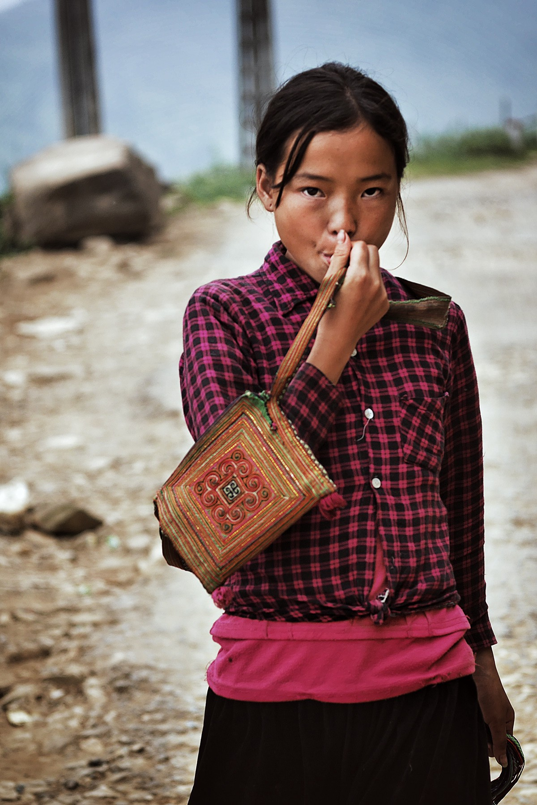

Later on, looking at my GPS data, I could see that I was really, genuinely in the middle of nowhere… and I’m so glad I got lost there.

**The villages, and the people in Sa Pa were a challenge for my very shy photographer’s nature**. On the one hand, it was ridiculously easy to take great shots of the people; on the other, it felt too intimate to do so that I almost always felt like I didn’t have that right. To just show up in front of them and steal a picture.

So every person I took a picture of, I had to make some sort of interaction with. Sa Pa was a lesson for me in this regard; **earn your right to steal a photography with the locals**. Not to mention, it makes up for more interesting memories as well. Remember when I said it is always about the people? Yeah, that. Lesson learned, Ricardo.

In fact, for Sa Pa overall, I’m going to let the pictures do the rest of the talking for me. For all it’s worth, I almost got run over by water buffaloes taking some of these pictures. I bought so many bracelets from the little kids, in exchange for some words swap and a quick picture snap. I eventually gave them the bracelets back, as I’m not sure how much of a good idea it is to feed this _business_.

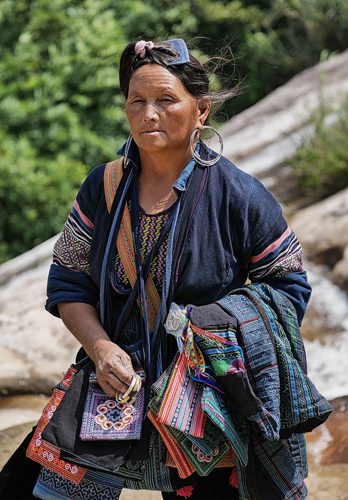

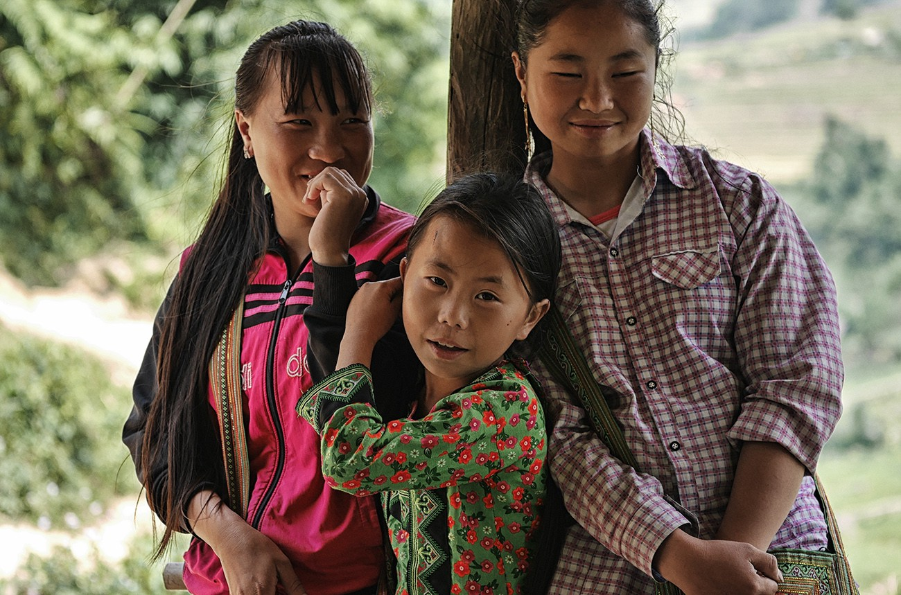

In Ta Van, I also had the unique pleasure of getting to know the family from my homestay. On my last night, Muan cooked us a wonderful shared meal that we’d all eat at their table, and I finally got to ask the million questions I had about the tribes at Sa Pa. My only regret was not having taken a picture of them, so I’m keeping their stories and sharing them with others.

The next couple of pictures were taken in the **Ta Phin** village:

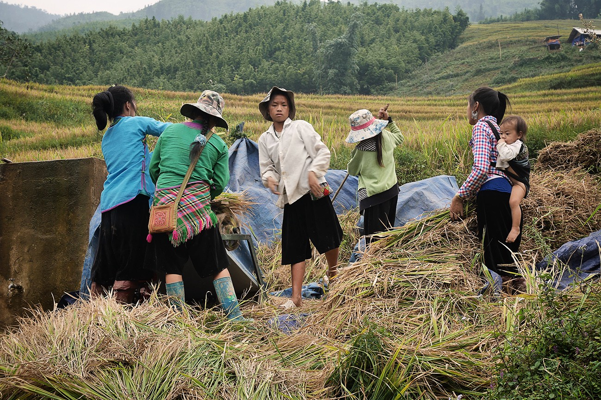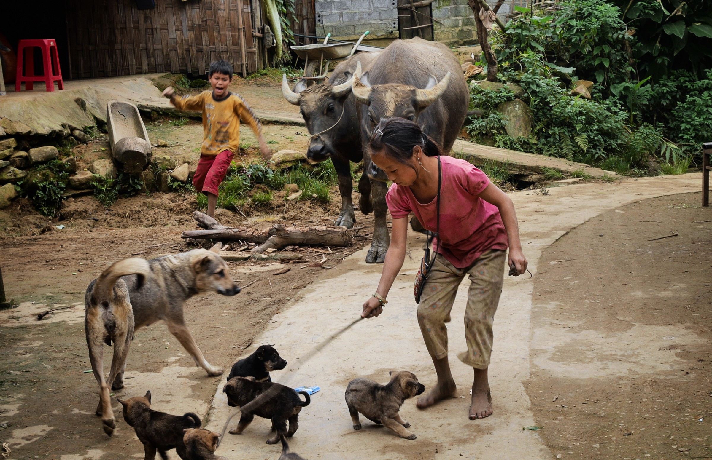

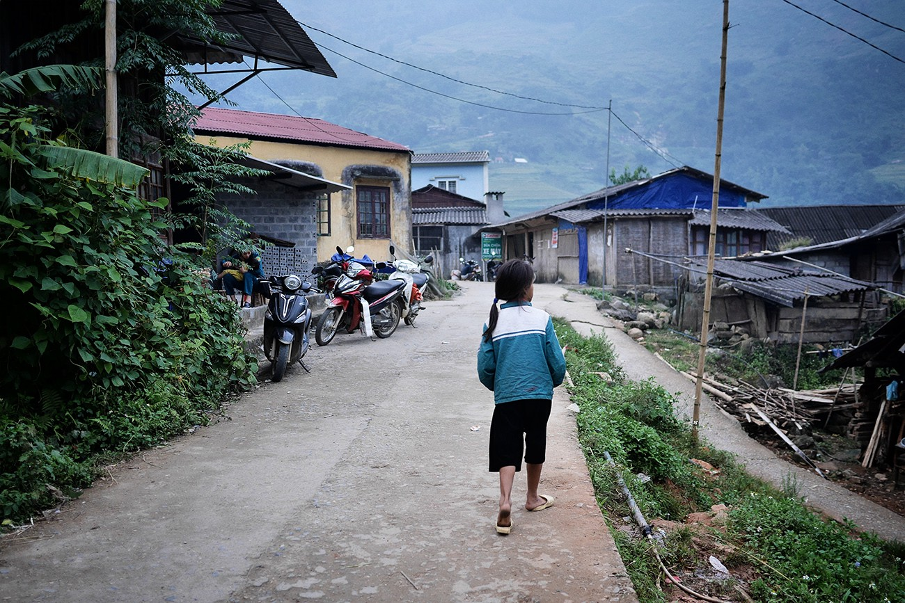

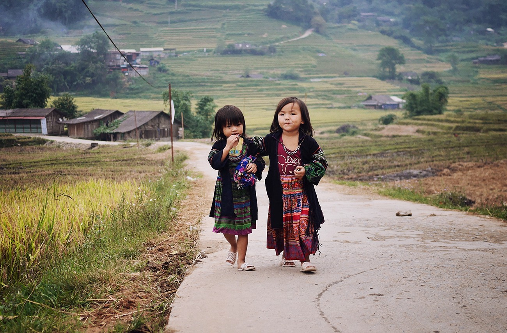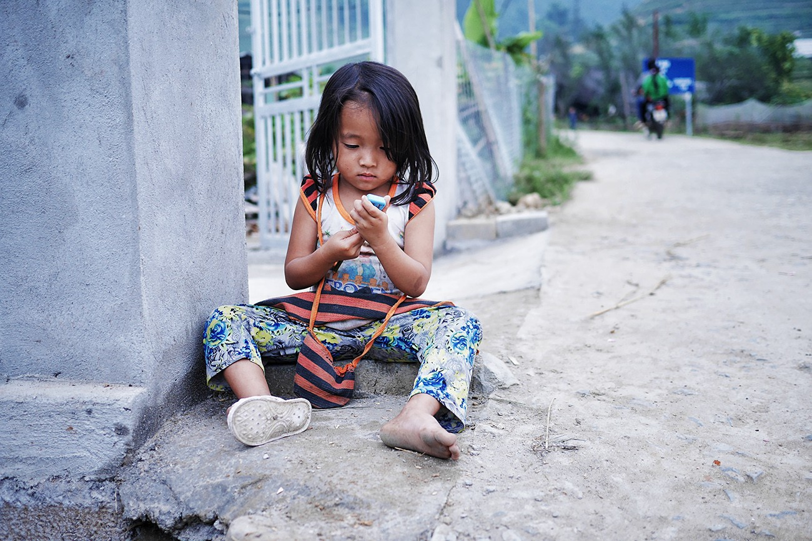

Coming back at night on my last night, with an incoming nightfall that goes from light to complete darkness in less that 15 minutes, I got lucky enough to capture an astonishing, apocalyptic-like scenery.

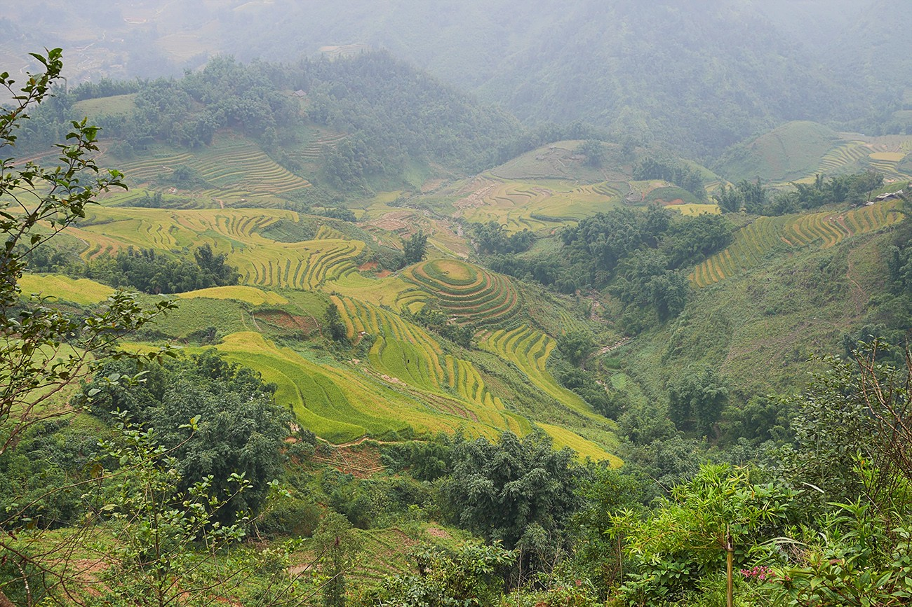

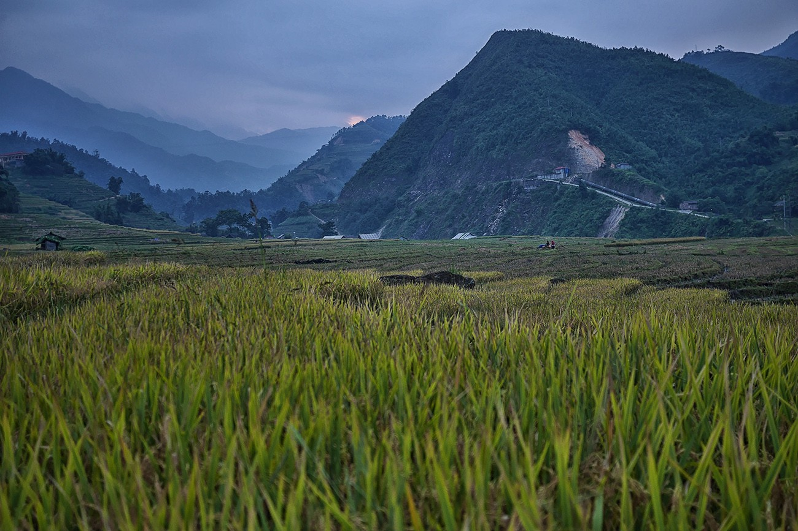

The next day, I’d take night train back. As luck would have it, yet again, while jumping on the bus to **Lao Cai** to the train station, I randomly stumbled upon Kim, who I had met a few days earlier at the Perfume Pagoda. _Small world, I thought._

Here’s where things got interesting: a bit more than an hour later, the bus driver completely forgot to warn us that we had reached the **Lao Cai** station… and we were now way past it. Luckily I had it saved on Google Maps, and asked the driver about it. He _facepalmed_, apologised, and opened the door for us to leave the bus… miles away from the station. Me and Kim started walking back, wondering if it would be wise to continue walking. However, shortly after this a random taxi driver pulled off by the side of the road and offered us a ride; as in, literally offered a ride, for free, back to the station. I remember us looking at each other thinking _“no taxi driver simply offers a free ride… should we risk it?”_—and these were genuine looks of concern.

#### But we did accept it. And this was a perfectly good lesson on kindness; a few minutes later, we were dropped off at the station, without any expectation to pay or give something back.

With hours to spare, me and Kim set off to explore Lao Cai. It’s a small and simple town, so we did what we thought best: we ate banana pancakes at a café, and then explored the farmer’s markets.

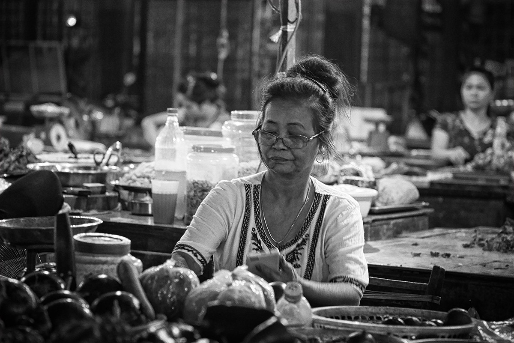

After that, we sad our goodbyes since we were on different night trains. I was off to Ninh Binh next. On the night train, I got to practice my Spanish with Lena who was in the bunk bed next to mine, and heard the stories about her previous adventures in Myanmar. I felt like I was there myself.

---

### Ninh Binh

**Ninh Binh** is mostly famous for one attraction, the **Tam Coc** boat tours. Most people don’t give the place another chance, since this tour can be squeezed in as a day tour from Hanoi. After researching a lot about Ninh Binh, I was sure it had more to offer than just a boat trip experience. As it turns out, it would become one of my favourite bits of this whole journey.

#### Tam Coc

I started by booking a tour there, but I negotiated the price down as I wouldn’t be returning back to Hanoi with the group. In fact, I learned that I could use this strategy a lot in Vietnam: book tours one way, stick around, find your way back somehow later.

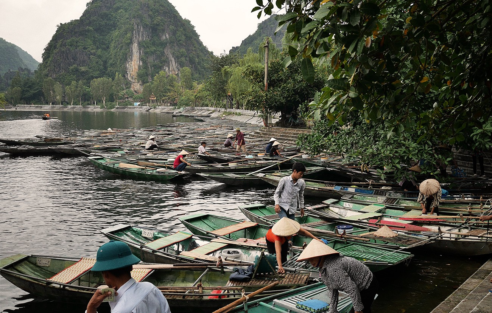

The Tam Coc boat tour itself is okay: the sights are absolutely incredible and it’s no wonder it’s referred to as the “Halong Bay” on land. You’ll get to appreciate the idyllic rocky formations of the region as you’re taken gently away on a boat, passing through 3 caves in the process (Tam Coc literally means _three caves)._ It’s a long journey and not the most comfortable on the small boats, but I’d still recommend them.

<Embed src="https://www.youtube.com/embed/Hi8jPa-ROf0?feature=oembed" aspectRatio={undefined} caption="" />

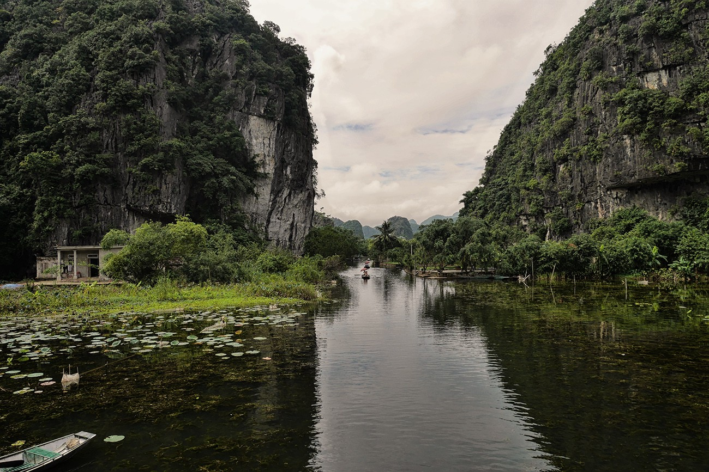

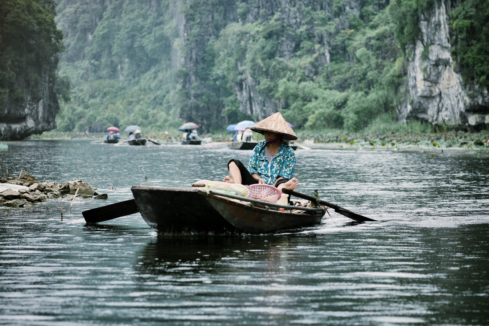

I had also booked a homestay for the night, and quickly learned that Tam Coc is easily explored by bicycle… and how. After having initially rented a scooter, I ditched it on the second day and got myself a bicycle instead. The lonely, remote but inviting swamp paths are the very definition of freedom with a bike.

The first thing I did was to **bike around the Tam Coc tour paths**, getting the inside view of what it is like _behind the scenes_. I got to see where the rowers were resting, taking naps, eating a quick bite before heading off again into the swarms of tourists coming in into the lakes. For an entire day, I biked with a massive grin on my face. After spending a lot of time in the [**Bich Ding Pagoda**](https://www.tripadvisor.com/Attraction_Review-g303945-d5570345-Reviews-Bich_Dong_Pagoda-Ninh_Binh_Ninh_Binh_Province.html), I headed off to explore the fantastic views of the [**Mua Caves**](https://www.tripadvisor.com/Attraction_Review-g303945-d5321519-Reviews-Mua_Caves-Ninh_Binh_Ninh_Binh_Province.html).

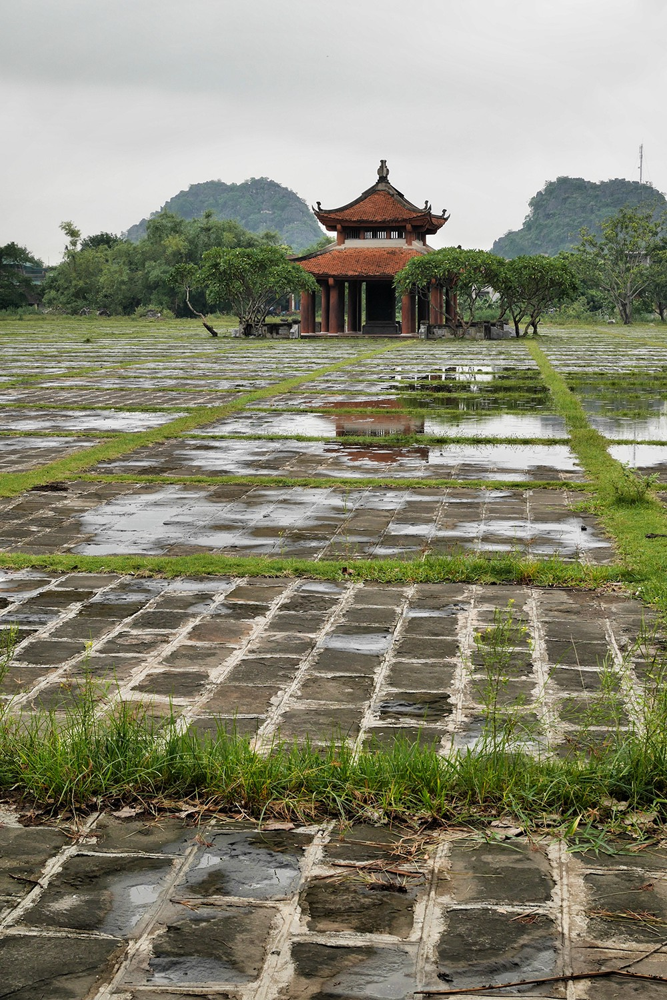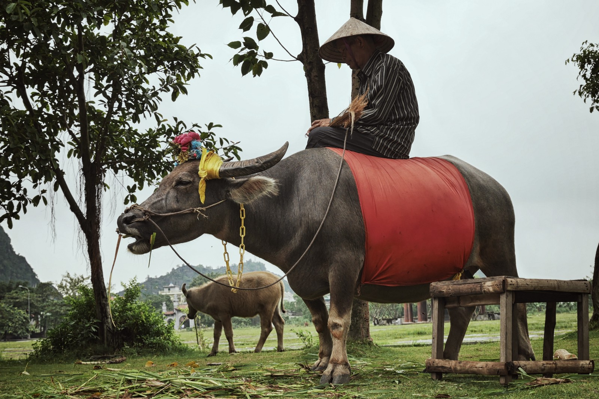

Ninh Binh was by then my happy place on Earth! I forgot about eating food, I forgot about time. I had wheels, a child-like curiosity to explore the swamp labyrinths and I was armed with all my (rather wet) lenses. It was lonely, though, but it felt like the world was mine to explore.

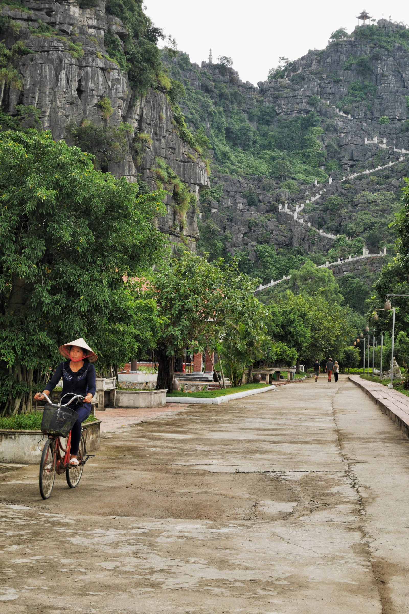

At the very top of the Mua Caves, I met two people who were also keen rock climbers and we stayed up there for a chat, before making our way down. I’d later find meet up with one of them in Hanoi’s **Vietclimb** climbing centre, as luck would have it! And the view from the top of the hill, you ask?

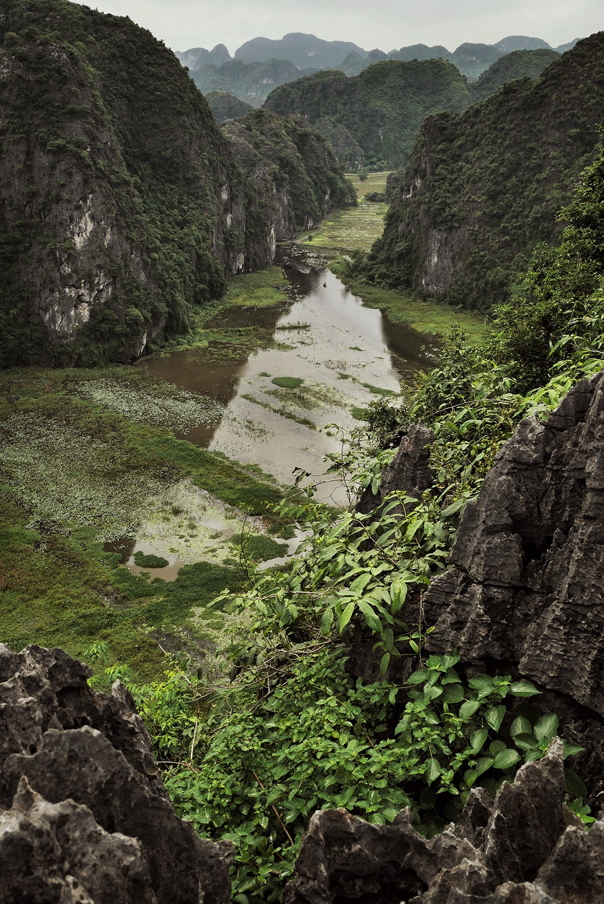

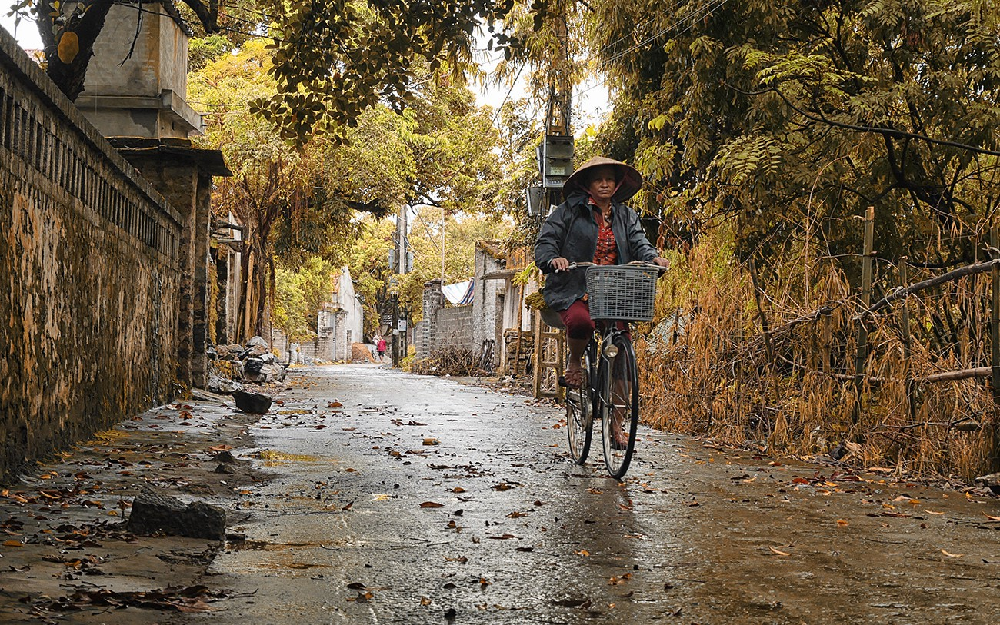

On my last evening, before hopping on the local bus back to Hanoi, it rained like hell. I hid again in one of the pagodas, and when the skies cleared up a bit I got to explore the area north of the **Bich Ding**, where I came across a very large cemetery on water. The skies were Godlike.

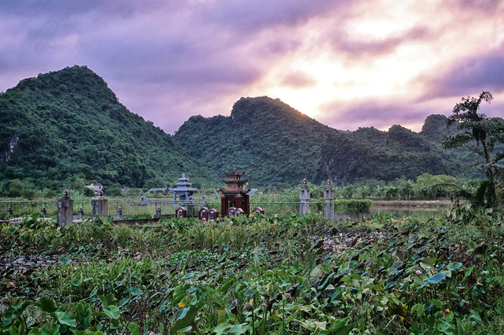

---

### Quan Lan Island

I was still on the fence about going to **Halong Bay**. On the one hand, it’s without a doubt of the most beautiful place in the world. On the other, now being part of the New Seven Wonders of the World of UNESCO, it’s super touristy. As in, almost unbearably so, according to some reports I listened to, and [read](http://annaeverywhere.com/halong-bay/) [online](https://www.worldnomads.com/travel-safety/southeast-asia/vietnam/halong-bay-recommendations) [as well.](http://travellingclaus.com/halong-bay/) There’s no doubt that a boat cruise in Halong Bay will not make you feel special, since you’ll be one in several thousands in a one mile radius at any point in time.

I found that [**Ethnic Travel**](http://www.ethnictravel.com.vn/) do off the beaten path tours, specifically designed to get away from the touristy scene of the area. I thought about Cat Ba Island, but eventually settled on **Bai Tu Long Bay**, by the recommendation of a few other people I met along the way. And boy, was I not disappointed.

A trip to Bai Tu Long Bay ends with an overnight stay at the incredibly remote [Quan Lan Island](http://wikitravel.org/en/Quan_Lan):

> Quan Lạn has been sparsely inhabited for quite some time. There are a few thousand residents and an influx of local tourists from Hanoi on weekends and holidays. The island itself is pretty sandy and has little in the way of forest, unlike others nearby such as [Ban Sen](http://wikitravel.org/en/Ban_Sen "Ban Sen"). Today, ports exist both at the northern and southern tips of the island. It is a less developed and less touristy alternative to the more popular Cat Ba Island.

Even less touristy than Cat Ba? Count me in! After negotiating my way in for a last minute tour with Ethnic Travel, and after getting in the wrong bus to get to the first leg of the journey (that’s a story for another time), some painful six hours of driving awaited until we got to the port in Bai Tu Long Bay. The upside: there were only three of us for this tour. **Only, three, people**. We had one of the junk boats to ourselves, and I can’t stress this enough: getting off the beaten path takes hard work sometimes, but sometimes it pays off really, really well.

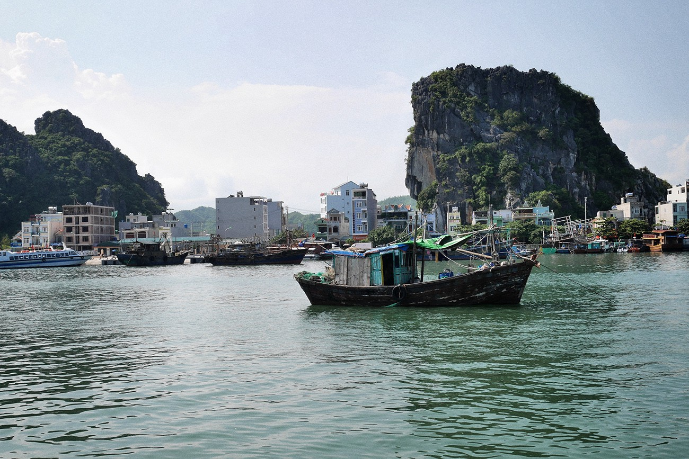

Some very laid back kayaking and fishing later…

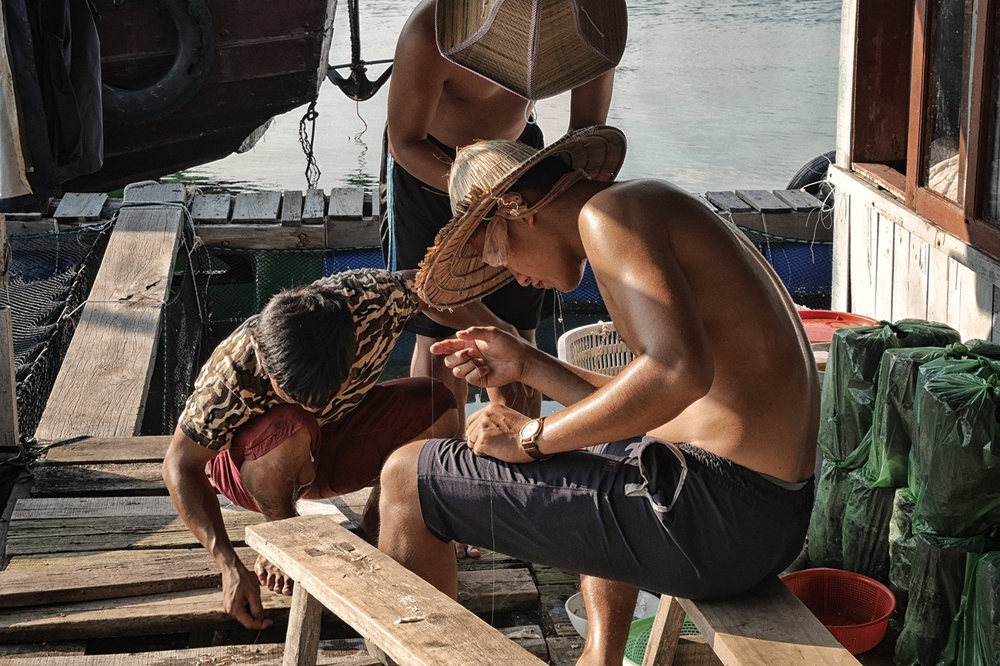

As we were anchoring on Quan Lan, I shot this picture with pretty much convinced me that I made a good decision:

[**Quan Lan**](http://www.halongbay.info/attraction/quan-lan-island.html) is very small, but thrives only on the local life. I negotiated my way into staying an extra night, since I decided immediately I wouldn’t be coming back the following night; I had enjoyed the warm waters of the beach way too much to return. Luckily, this was not a problem, nor was finding a place to stay unannounced in the island. The only real problem was having to wait until someone actually showed up at the empty, ghost-like hotel to check me in. For 8 euros a night on a double room with A/C, I did not complain (despite the fact I had about 5 geckos in my bedroom).

Life in the small town of the island is as real and as raw as it gets:

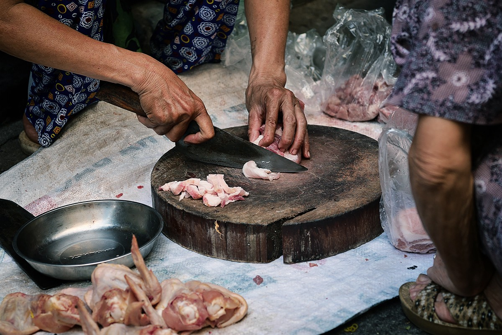

I didn’t take many pictures in Quan Lan, as they wouldn’t make it any justice anyway. Plus, I needed the time to wind down. I spent more time hiking around the island (a terrible idea under 40 degree heat, as my skin now confirms even a few weeks later), and reading [my book](https://www.goodreads.com/book/show/341879.Just_Kids) on the beaches. It did make up for the most glorious sunsets I ever saw, though:

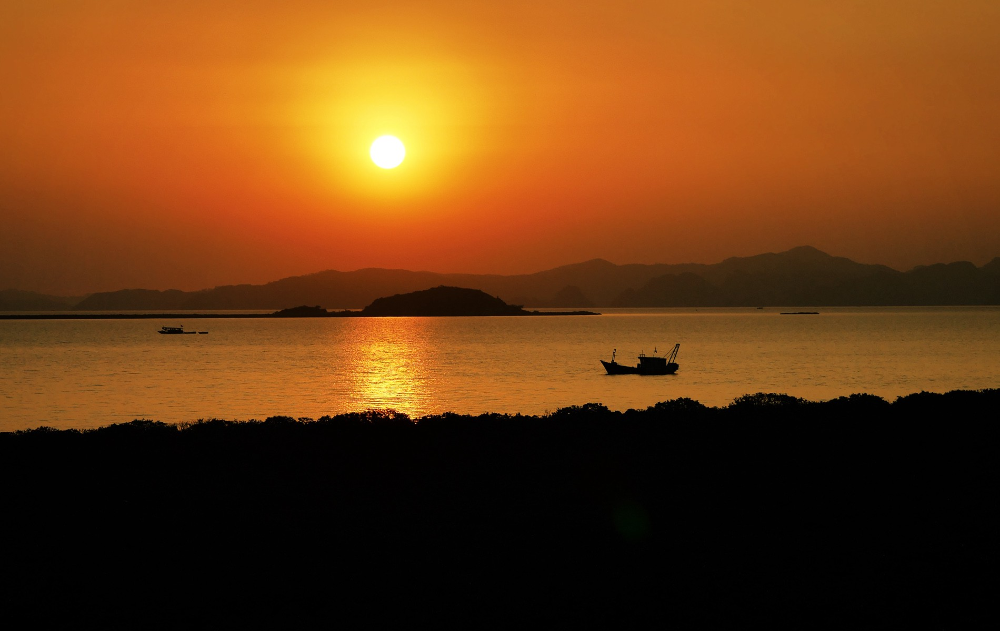

### Back in Hanoi

Last day in Hanoi, before the flight back.

I got to see a few of the museums and art galleries I’d wanted to see. My favourite simply has to be the **Vietnamese Women Museum**: what a dedication to the role women in Vietnam had in all stages of its life! Since their role in the early days of the communism stages, through the war and up to modern days, this museum ranks high at the top of the best I’ve seen just about anywhere.

For e.g.: In the South alone, during the war, women represented about 40% of the guerrilla and militia forces. We’re talking about close to 1 million women. The female artillery alone destroyed 12 planes in 1969. Also, in memory of the battle of Reunification in September of 1994, Vietnam has officially recognised and remembered the silent sacrifices of the women who lost husbands and children. A few of the women received an honorary title of **_Heroic Mothers of Vietnam_**.

Vietnam also has a surprising lively and active art scene. Visiting places like Manzi, Art Vietnam and a few others, it was very clear that underneath the aggressive, business oriented mindsets, there is this craving for artistic exploration that’s as strong as any major European capital.

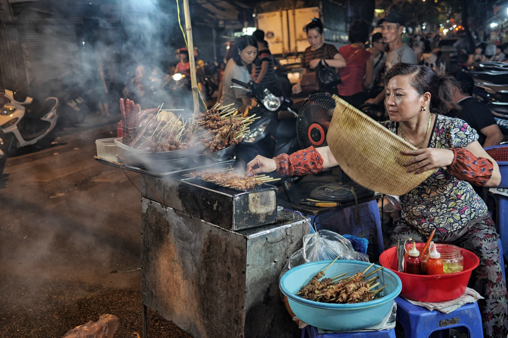

A few more cafés later, including the ever-so-wrong-but-oh-so-delicious egg coffee, followed by more street food, it was time to go back home.

---

#### Closing thoughts

I wished I had had time for more, there was so much left unseen, untouched, undone… and uneaten. 15 days were not enough, but I wouldn’t have done it any other way except the slow travel way. Had I rushed this trip to fit in more places (like Hue and Hoi An, which I desperately wanted to see) I would have missed out on so much, and on so many experiences you only get to feel by learning how to sit still with the local life and taking your (sweet) time.

> Travel doesn’t shape you so much as the people you meet along the way shape you.

And that’s why I’m hungry for more. I’m hooked.
