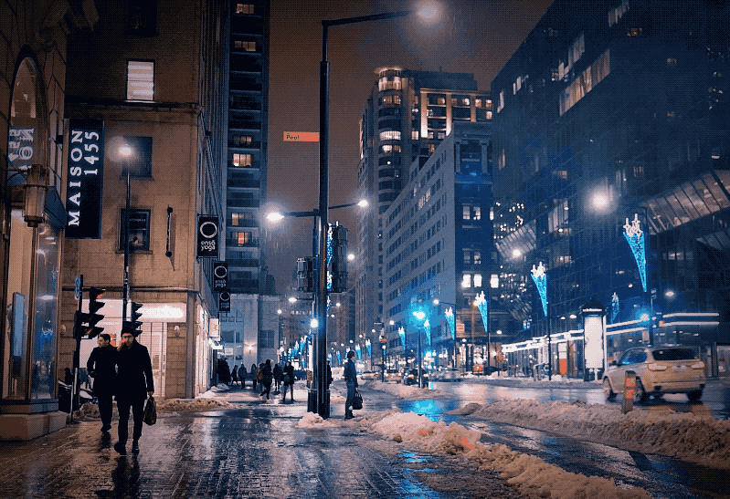
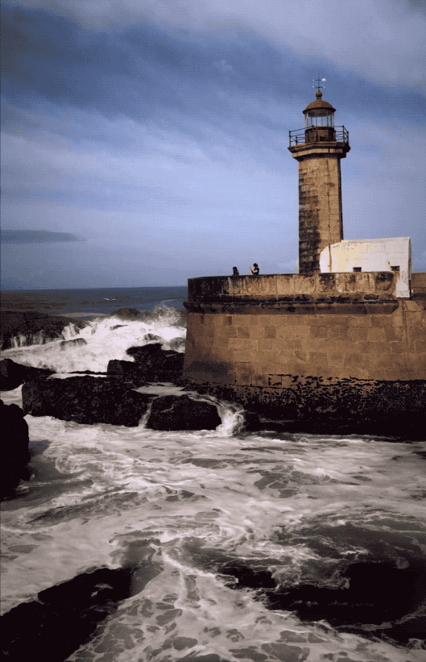
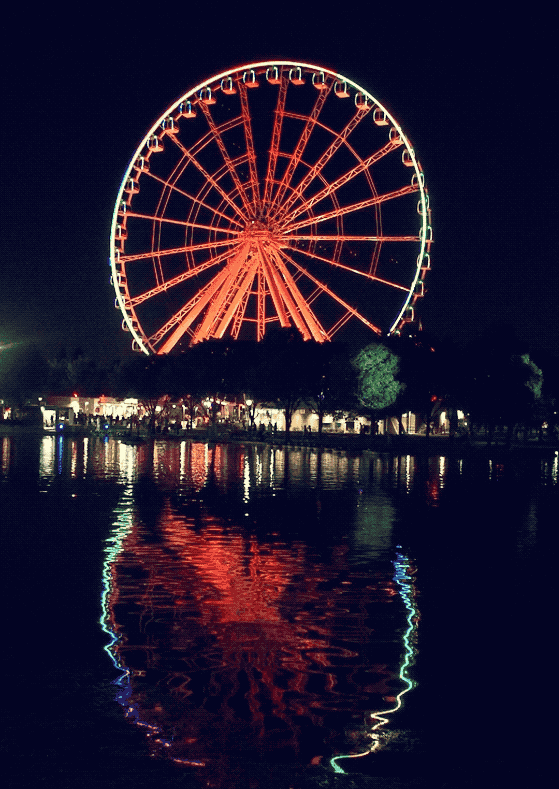
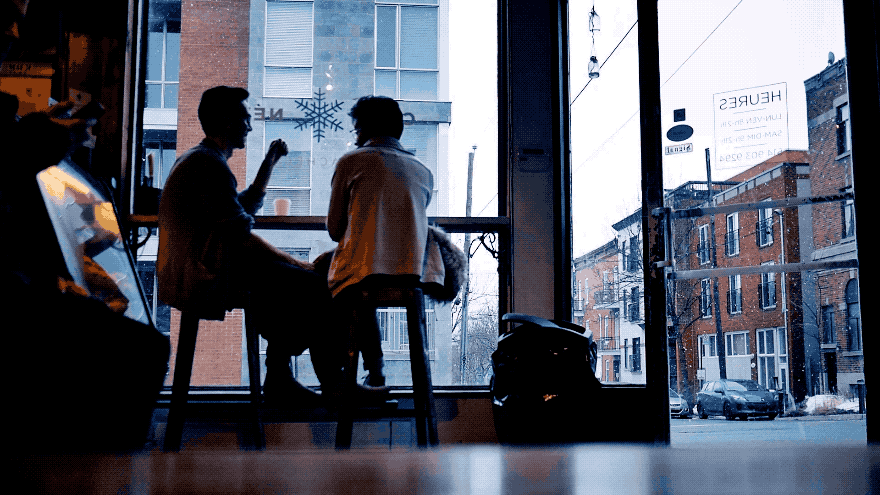
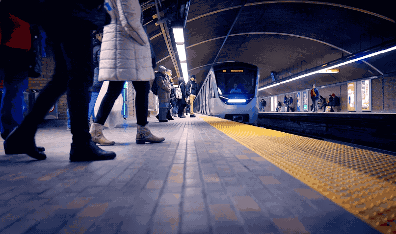
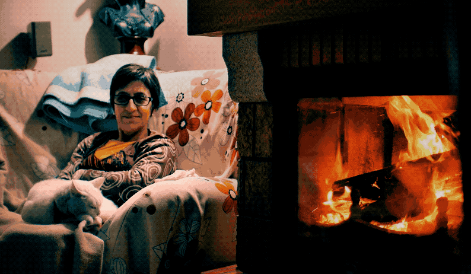
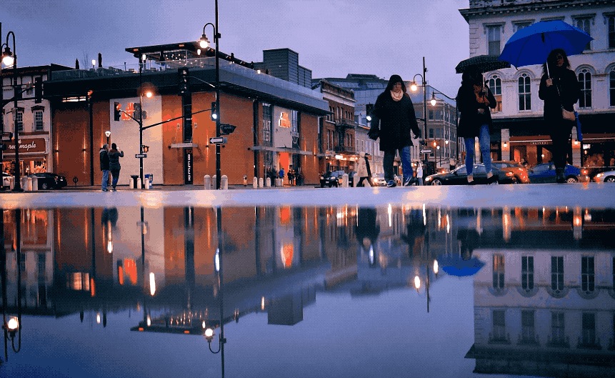
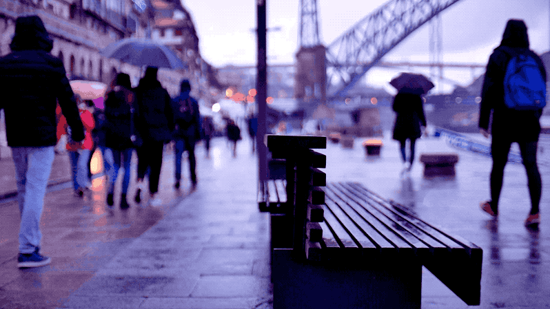
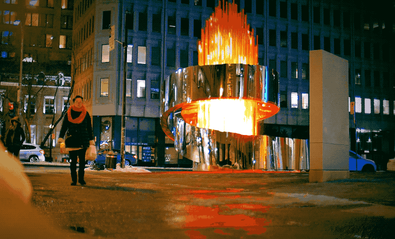

Earlier in 2018, I spotted a random advertisement on Instagram which featured a _cinemagraph_. As the eternal amateur photographer, my mind immediately responded to this with a very loud and childlike “Oh, _I want that!_” A cinemagraph is essentially a motion still, of sorts, in which part of the picture is moving, but the rest isn’t. A surreal and impossible visual experience; yet not a montage. This was one of the first few I did this year:

And so I started reading online on how to do these animated stills, with as little friction as possible. What I didn’t see coming was that the process of making these is actually remarkably simple: some basic video editing skills on Photoshop, a little patience, and you’re done.

Instead, it’s the **act of shooting them**, from idea to conception, that’s remarkably difficult. You see, the camera can’t move a millimetre during the filming, or the whole thing is later ruined. Whatever you plan on having in motion can never fuse with the background — at all— or it will bleed into the masked animation. I’ve had dozens of attempts ruined by one of these factors.

Here’s a few I’ve made throughout 2018. Their originals are high-quality videos, **and what you’ll find here are slimmed down, janky GIFs instead** — but I kind of like their raw feeling. If you’d to see them in higher quality, find them on my Instagram or ask me.

---

City ones are, as always, personal favourites.

And my absolute favourite, another one from Porto which took a million years to film,

#### What did I learn from making all these things?

A few things, in fact!

#### 1\. Art can be silly.

When photographing, I’m always looking for the perfect meaningful scene. So many shots don’t make the cut because they’re neither exceptionally beautiful, or exceptionally meaningful. Making these cinemagraphs has taken away some of the weight of conceptual perfectionism away.

#### 2\. Create more excuses for play

And I mean play, for the sake of play. Since you’re no longer looking for meaning or visual perfection, an idea as simple as a football rolling on a playground can be visually stimulating, if you get the right background in.

#### 3\. Working constraints are fun, again!

I re-learned how to love working with creative constraints. A blank page is quite often too daunting, and so is the idea of a whole city waiting to be perfectly photographed. Knowing you’ll have to plan with wherever you are; with a place you can physically place your camera for it to be super steady; and needing a scene which works in just 3/4 seconds, and your brain will be pumped thinking about the possibilities. Embracing constraints is a beautiful thing to learn how to achieve.

#### 4\. There’s SO much happening around us, right now

If you’re sitting at a coffee shop or a library, take a look around you. Who is moving in the foreground, and who could be steady in the background? Is there a fan in the ceiling you could play with? Maybe something moving outside the window that you can stop in time. There’s interesting movement everywhere — but we only notice it when we’re looking for it. Creating a cinemagraph forces you to be immersed into this mode.

If you’re curious about the process, hit me up on the comments or on [Twitter](https://twitter.com/magalhini)!
