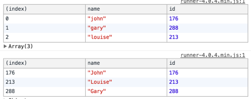

## Unlike most _trends_ in the world of JavaScript, data immutability is bound to stick with us for a while, and for good reason: firstly, because it’s not _a trend:_ it’s a way of coding (and thinking in code) that promotes clarity, ease of use and understanding data flow, and makes code less prone to errors.

But while newer flavours of the JS language gives us a more robust [toolset](https://hackernoon.com/tagged/toolset) to work with than ever before, without the use of libraries like [**Immutable.js**](https://facebook.github.io/immutable-js/), things can still look a little bit scary when you put it all together. Getting comfortable with reading and writing the most common use cases is very helpful.

In this short post, we’ll look at pure JS ways (with ES2015++, and yes, I may have just invented this notation) to, add, remove, and update deeply nested properties in Objects, Arrays, and finding common patterns to reproduce these operations.

_Playground:_ [_Direct link to the JS Bin_](http://jsbin.com/kikajon/edit?js,console)

### Objects

Let’s take an initial object, _person_, which we can think of as being a piece of application state, that we want to mutate. À là redux thinking, we should always return a new copy of this state and **never change it directly**.

```js
const person = {
  name: 'Ricardo',
  location: 'Berlin',
  interests: { coffee: 9, climbing: 9, wasps: 0 },
}
```

### Changing a simple object property

Modifying a top level property is remarkably simple using _Object.assign_. We'll explore more of its use cases (and alternatives) in a little bit, but for now let's simply create a modified copy of our object with _name_ set to "Douglas".

```js
const updatedPerson = Object.assign({}, person, {
  name: 'Douglas',
})
```

_Simples_. We’re telling Object.assign to _take this empty {}, apply person on top, and modify the name property_. The rest of our object looks the same.

### Changing deeply nested properties

Here’s a common mistake when using _Object.assign_ to copy an object: forgetting to copy the **inner objects** we're trying to mutate. Let's say we want to change the _coffee_ interest to _10_ and _location_ from "Berlin" to the "Moon" (a common train route from Berlin). What if we try the following application:

```js
const updated = Object.assign({}, person, {
  location: 'Moon',
  interests: {
    coffee: 10, // Crap! Only this one is copied
  },
})
```

On the surface, it might seem like this works, but this doesn’t copy the rest of the _interests_ object. It will leave us with an updated _{coffee: 10}_ and _location: 'Moon'_, but it won't copy _climbing_ or _wasps_. No one needs wasps, anyway. But how do we solve this?

Instead, we need to also deeply copy the _interests_ object, like so:

```js
const updated = Object.assign({}, person, {
  location: 'Moon',
  interests: Object.assign({}, person.interests, {
    coffee: 10, // All other interests are copied
  }),
})
```

Notice the double _`\_Object.assign_`\_. A bit verbose, in truth, as all objects need to be assigned in order not to lose properties.

### Spread operators

We can make this look more tidy by making use of the _`\_spread_`_ operator, which takes the form of _`_..._`\_ — in fact, the previous example can be re-written as:

```js
const updated = {
  ...person,
  interests: {
    ...person.interests,
    coffee: 10,
  },
}
```

Much nicer to look at! Spread operators are so incredible that you should definitely [read more about them at MDN](https://developer.mozilla.org/en/docs/Web/JavaScript/Reference/Operators/Spread_operator).

### Deleting properties

Now, onto deleting (or removing) properties from objects. The _delete_ keyword is a mutating action, so we can't use it when we're thinking about immutable data.

There’s a few different ways to go around it, some more efficient than others. One (slow-ish) approach is to recreate our entire object, but **ignoring the properties we want to be removed**. Let’s create a function that accepts our object, and the name of the property we would like to see removed:

```js
const removeProperty = (obj, property) => {
  return Object.keys(obj).reduce((acc, key) => {
    if (key !== property) {
      return { ...acc, [key]: obj[key] }
    }
    return acc
  }, {})
}
```

_Note: this was written in long form for readability’s sake. You can omit some of those return statements._

It looks a bit convoluted, but what’s happening is pretty simple: for each key that **is not** the one we passed, we keep adding them to the accumulator, returned by the _reduce_ function. So now, if we wanted the _interests_ property removed from our _person_ object, we can use this like so:

```js
const updated = removeProperty(person, 'interests')
```

Which would give us a brand new copy of the object, except for that one ignored property:

```js
{ name: 'Ricardo', location: 'Berlin', }
```

### Aside: using lodash

If you’re using **lodash** in your project, then you can make use of some its methods to help you change objects. **However, you should note that by default, some of lodash’s methods mutate the original objects**, which more often than not will mess up your immutable data. An exception, however, is [the](https://lodash.com/docs/4.17.4#omit) `[_.omit](https://lodash.com/docs/4.17.4#omit)` [method](https://lodash.com/docs/4.17.4#omit), which you can use to delete a property from an object.

Once again, let’s try and remove the _interests_ property like we did before, but using lodash. This time, we'll write it in a reducer-style function, just as an example:

```js
import { omit } from lodash;

const reducer = (state, action) => {
  switch (action.type) {
    case 'DELETE_KEY':
    return omit(state, action.key);
    default:
    return state;
  }
}
```

This will work, even without the _/fp_ subset of lodash. So if you’re already using lodash, you’ll get this for free. We could use it like this:

```js
const newState = reducer(person, {
  type: 'DELETE_KEY',
  key: 'interests',
})
```

_…which would give us the same result. Once again, be weary of using some lodash methods when reassigning data, as_ **_most of their methods mutate the original object_**_. Consider using the_ [_/fp_](https://github.com/lodash/lodash/wiki/FP-Guide) _subset variation._

### More complex updating

It can be hard to grasp how to mix and match these operations for objects. Recombining properties, while updating them at the same time, is a pattern very commonly used with Redux reducers. For practice, let’s look at an example of a more complex operation.

Consider our original data, an array of users with a name and an ID:

```js
const users = [
  { name: 'john', id: 176 },
  { name: 'gary', id: 288 },
  { name: 'louise', id: 213 },
]
```

In **Redux**, it’s common practice to [normalise your application state](http://redux.js.org/docs/recipes/reducers/NormalizingStateShape.html), by having data grouped by ID for easier lookups. So let’s say this is what we want to do: we want a **new array** which has the users **grouped by ID**. For kicks, let’s also have the **first letter of their names uppercased.**

In short, we want to go from the first table, to the second one:



How do we return the _object.id_ as a key, though? This is where you'll see the _[item.id]: something_ notation. It allows you to dynamically pull in the value and use it as a key. So with that in mind, let's write our _byId_ function that also uppercases the first letter:

```js
const byId = state =>
  state.reduce(
    (acc, item) => ({
      ...acc,
      [item.id]: Object.assign({}, item, {
        name: item.name.charAt(0).toUpperCase() + item.name.slice(1),
      }),
    }),
    {}
  )
```

If this method could talk, here’s what it would say:

_Hey, you there: For my state, apply the_ _reduce_ _method, which will give you an accumulator starting with an empty {}, and all my items. For each one, spread the accumulated properties, but add a new key with the value of each \[item.id\]. Inside each one of those, make a copy of_ _item\_\_, but also modify its_ _name_ _property while you’re at it._

This will **return a new object with the ID of each user as the key**, spreading all their values into each object, and modify their _name_ properties to have the first character uppercase.

What if we wanted to update more properties, other than just the name of the user? This is where you’ll think about combining **pure functions** in order to manipulate the data as you need, but always returning a new copy. Let’s refactor this a little bit by creating a _updateUser_ function:

```js
const updateUser = user =>
  Object.assign({}, user, {
    name: user.name.charAt(0).toUpperCase() + user.name.slice(1),
  })

const byId = state =>
  state.reduce(
    (acc, item) => ({
      ...acc,
      [item.id]: updateUser(item),
    }),
    {}
  )
```

All we need now to get a new piece of state with our users grouped by ID is simply:

```js
const usersById = byId(users)
```

### Arrays

Cool, so what about immutability in arrays? Let’s consider an original piece of immutable data:

```js
const original = ['a', 'c', 'd', 'e']
```

Having an array, you would often want to do one of the following:

- Insert an item by index
- Remove an item by index
- Remove by item
- Insert an item to the end

### Inserting by index

We’ve conveniently forgot to add **b** next to the **a** value in our index. Oh no, what a tremendous disaster for our alphabet app! How do we insert an item at a given index, in an immutable fashion? One way to think about it is to:

1.  _Copy the array_ **_until_** _the specified index_
2.  Insert our item
3.  _Copy the rest of the array_ **_from_** _the specified index_

So we could write a helper function with the following signature:

`insertByIndex = (state, newItem, insertAt)`

> _Where_ _state_ _is the original array,_ _newItem_ _is the value of the item we'd like to add, and_ _insertAt_ _is a number (index) at which location we want to insert our_ _newItem\_\_._

A simple way to write such a helper function could be the following:

```js
const insertByIndex = (state, newItem, insertAt) => [
  ...state.slice(0, insertAt),
  newItem,
  ...state.slice(insertAt),
]
```

_Wait, what?_

Okay, let’s break this down. We’ve already seen that the _spread_ operator (...) copies values, and that's exactly what we're doing here. First, we're returning a new Array; copy it from the beginning until our index, insert our new value (b), then copy the rest of the array from there.

So an example of its usage would be:

```js
insertByIndex(original, 'b', 1)
// ["a", "b", "c", "d", "e"]
```

### Removing by index

Removing an Array by index is much simpler, luckily, as long as we can afford to use _Array.filter_. Let's think: The _filter_ method gives us the index value as the second argument, so that means we want to return _all values which don't have the index of N_.

```js
const removeByIndex = (arr, at) => arr.filter((item, idx) => idx !== at)
```

### Removing by item

If you want to remove an item directly (say, b, instead of its index), we can still use _filter_ like we did previously, but we'll filter out the item itself and forget about the index:

```js
const removeByItem = (arr, value) => arr.filter(item => item !== value)
```

### Adding an item

Adding an item to the end of an Array is also quite simple, but **don’t you dare to think of push!** In fact, good old _concat()_ is your immutable friend. Using *.push* mutates the original array, which will inevitably lead to unpredictable behaviour.

```js
const addItem = (arr, value) => arr.concat(value)
```

So if we wanted to add _banana_ to our alphabet array (why wouldn't you?), we could do:

```js
addItem(original, 'banana') // ["a", "c", "d", "e", "banana"]
```

### Food for thought

Even if you’re using an immutable library like Immutable.js or the [fp flavour of lodash](https://github.com/lodash/lodash/wiki/FP-Guide), it’s still a great idea to have a good grasp of how immutability works with simple [JavaScript](https://hackernoon.com/tagged/javascript). Immutable.js comes with a hefty weight as a dependency, and there are alternatives such as the also popular [dot-prop-immutable](https://github.com/debitoor/dot-prop-immutable).

When should you use a library for immutability or go raw with JavaScript? That really depends on the complexity of your data changes, the amount of overhead you can bring both to your codebase and to your team (it’s _yet another thing to learn_). I’d argue that knowing the barebones implementation of most patterns is useful to understand, especially when using Redux or any other similar pattern that thrives in code immutability.

**Very useful resources:**

- [Intro to Immutable.js](https://www.sitepoint.com/immutability-javascript/)
- [Redux Immutable Patterns](http://redux.js.org/docs/recipes/reducers/ImmutableUpdatePatterns.html)
- [More ES2015 examples](https://wecodetheweb.com/2016/02/12/immutable-javascript-using-es6-and-beyond/)
- [Spread Syntax: MDN](https://developer.mozilla.org/en/docs/Web/JavaScript/Reference/Operators/Spread_operator)

Anything I might have overlooked or gotten wrong? Don’t be afraid to ping me on [Twitter](http://twitter.com/magalhini).

---

_Originally published on my personal blog at_ [_blog.ricardofilipe.com_](http://blog.ricardofilipe.com/post/immutable-changes-in-js)
