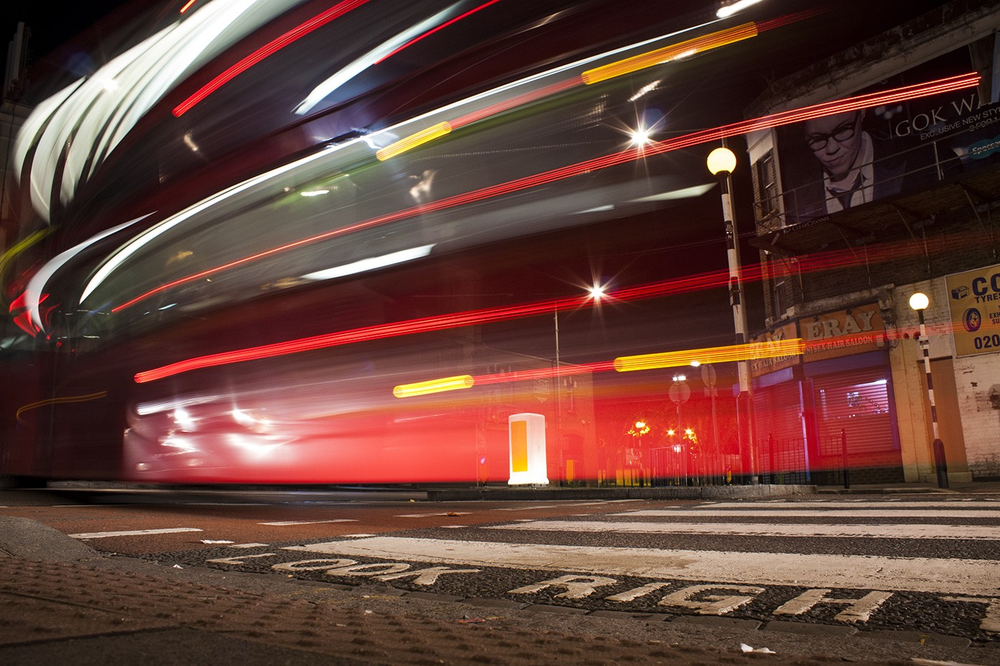

_— A bus taught me a lesson._

Today I took the bus in the evening, going home after work. Just like most Mondays.

Only a few meters after it departed, the bus took a different turn: it went the opposite way at the roundabout. Right instead of left, 180º instead of 0º. East instead of West. No signaling of any detour was visible, and the crowded bus had a chain reaction that any behavioral psychologist would find very appealing to study — distress among the passengers had clearly settled in!

The woman to my right immediately asked me, very concerned: “_is this the 486? Why is it going this way?!”_

The _STOP_ bell was ringing like it was _1999_ getting ready for the new millennium LED party. Passengers were doing all they could to ensure they wouldn’t end up on the other side of London in just _40_ seconds until the next stop came — or worse, that it would transport them to a shady Cambodian alley where they would struggle to get food and shelter for the following twelve years.

Are we **this** afraid of change?

Are we so used to a routine where a simple bus going the other way on a roundabout is enough to send people into what was probably the biggest distress of their day? Taking this much comfort in the predictability of our _15_ minute bus’ journey should teach us a thing or two about the way we act on our **life-long** journey to the next stop, wherever that may be.

We’ll get there, somewhere, in the end, even if that means finding our way through a different road. If you get detoured, enjoy the new view from the other side, instead of panicking about how to get back to your point of origin. Your life isn’t governed by the _Transport for London_ (otherwise you’d have engineering works every weekend) and we don’t have a number like _486_ written in our foreheads telling us where to go.

After all, if there’s something you really **don’t** want to do in your life is to press the _STOP_ button when things seem to take a wrong turn. Embrace a little unpredictability, and while you’re at it, walk more often too.
