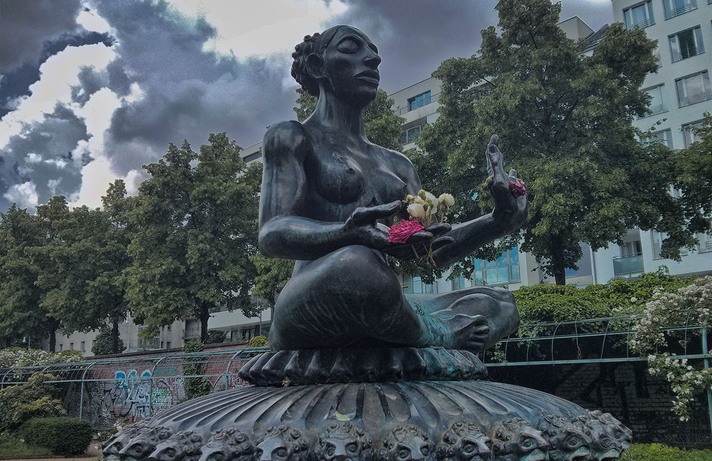

It was our fourth and last day together in the city. After so long, my parents had finally found time in their life and hearts to visit me in Berlin. After several hours of intense sightseeing, I had purposefully chosen this spot for us to take a break; a beautiful park in the heart of Kreuzberg, where an Indian Goddess fountain sits gloriously in the middle.

*“What’s the story of this statue?”* — asked my mother, curiously. “_Does it have something to do with that Buddhism thing that sometimes you’re on about?”_

I laughed at that cute, innocent way of putting it. Instead of laying down the facts about the fountain (I had done my homework), I followed it up and asked her:

*“What do you know about Buddhism, by the way? Do you still remember anything I told you about it in the past?”* — I asked.

*“Well… I remember there’s a Buddha. That’s it, I think. But this isn’t it. Buddha is fatter!”* — said mother laughing.

I grinned so much for a good while. I briefly (re)-explained the main ideas of Buddhism, touching on the celebration of the impermanence of life and everything in it.

> **“See, the beauty is in the impermanence. Today you and dad are here with me, tomorrow you’re back home. It feels good now, we should remember that it won’t last”.**

*“I see…”* — she replied. “_Well, is it still okay if I decorate the statue with some flowers? Just because the statue is also impermanent doesn’t mean it can’t be prettier for a while”._ And so she did; cutting off a handful of flowers from the garden, she carefully placed them on the Goddess’ hands. *”Impermanent, but now prettier!”* — she said.

Fast-forward 24 hours.

With them gone, there were no traces of their visit here anymore. Business, life as usual. On my way back from work the next day, I deviated from my usual path so I could visit the park again. The flowers were still there and there were people taking pictures of them, probably wondering about how they got up there. I sat nearby for a while, and with a birds’ eye view I tried to make sense of the scene: my mother’s first naive attempt at celebrating impermanence had had a sort of _permanent_ impact after all.

I climbed down towards the fountain, and just like the others I also snapped a photo of the flowers. Was I clinging to a permanent piece of my own teachings about impermanence? I probably was, yes — but then again, I didn’t even tell my mother this isn’t about Buddhism. Not that it mattered, I took the moment as it was.

This is my permanent reminder that leaving beautiful marks in the world takes less effort than I always imagine. We’re constantly trying way too hard, forgetting that a pinch of curiosity goes a long way.
