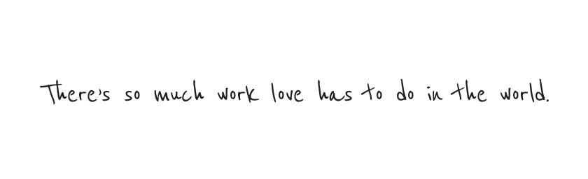

For as long as I’ve known this one very dear friend of mine, a friendship spanning for almost a decade now, I’ve been finishing most of our long conversations, often times in the form of a letter, with playful variations of three simple words:

> “Be love, today.”

I think it’s easy for us to underestimate the essence of _being love_. For one, we might think this requires an otherworldly amount of effort, but being love should, in a perfect world, be effortless. Yes, it may  seem inherently complicated and quite the daunting task, but you see, I believe its innate simplicity has just been somewhat forgotten, as we choose to wear more layers of emotional armour.

The strongest ingredient of being love is of course copious amounts of _kindness_—an ingredient which we seemingly have also forgotten how to wield properly in this day and age. But kindness too was never meant to be over-engineered, or treated like a game power-up to be picked up occasionally for emotional super powers. Choosing to make it a part of our daily persona suddenly seems like it needs scheduling, a calendar, so much afterthought. But, why overcomplicate kindness?

And that is also why that third word, _“today”_, also plays such a mandatory role in this formula. Along the way, postponing _being love_ has created an impulse to keep love locked, lost in ourselves, instead of us freely distributing it in our day-to-day interactions with the ones who matter. Not _being love today_ isn’t just a missed opportunity, it can be soul crippling. A missed chance to drop a kind word of appreciation or encouragement to a loved one is also a missed chance to stir a soul, even if for a brief moment.

**Rebecca Solnit**’s words have once put it so simply:

> “There’s so much work love has to do in the world.”

I, too, am still learning how to make it feel like it’s not an ambitious task, but this is the position I strive to base my days on. There really is so much work love has to do in this world.
