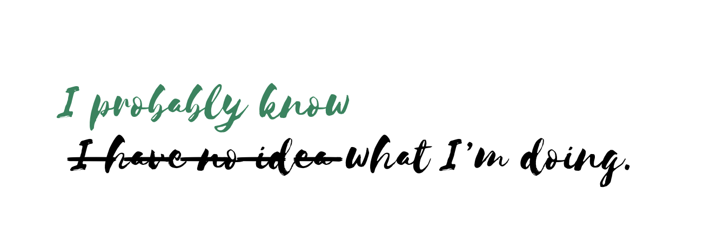

Lately I’ve been thinking a lot about just how much impostor syndrome, paired with copious amounts of self-deprecating humour, have been hindering my ability to effectively grow both as a human being and as a software developer.

You’re probably already familiar with this kind of interaction:

> “Hey, I heard you’re the go-to person on \[X\] subject! What do you think about \[Y\] for this project?”

> —“Oh, no, me? I barely know what I’m doing, really! Here’s what I think about it \[…\] but please, don’t take my word for it.”

It’s one thing to dismiss this as just being a little humble: after all, no one wants to come across as the holder of All Knowledge™, nor do we feel like committing to give advice that might _potentially_ be wrong. But here’s the thing about the software development industry (and really, most other fields too): _seniorship,_ whether you’re a technical or a people leader_,_ requires a certain degree of confidence, and confidence requires taking risks even when you’re not 100% sure about the decisions you’re about to take.

For the past year, all my conversations with my lead in our 1:1s have, in one way or another, made me realise how much I abstain from technical leadership based on feelings of _“I’m just here to learn, really”_. It’s **a way of making myself small**, and also to refrain from owning the responsibility of decisions with higher impact. Just the same way I dodge a compliment with self-deprecating humour 10 out of 10 times, what I’m really saying is _“I’m not ready for this”_.

But maybe, just maybe, we are ready for this, and so we’ve been all along.

> Think about your own leaders, whom you follow in real life. Would you still trust their words if they always came with a warning stating that “oh please, I don’t know what I’m doing, you should look elsewhere”?

Relying on other people, the “smarter people”, to come up with the best decisions all the time can be harmful and prevent us from developing these skills needed for any kind of leadership. For once, you will always be surrounded by someone with more knowledge/context/experience/outright-intelligence than you, (and that should always be the case); but dismissing your own experience and running away from taking the lead can be a wasted opportunity.

There is a world of a difference between consulting your peers about your decisions, and outright dismissal of your own gut feeling because, _oh what do I know_.

It is a form of long-term self-harm, and **potentially unfair to your team to take most of the blame**, all the time. It’s helpful to remember than no one would consult you if they weren’t genuinely interested in what you have to say — and at that point, you can either let a little bit of insecurity out (which is fine) or let all of your insecurities out and let them prevent you from acting (which is not fine). It’s time for me to stop doing the latter.

So the next time you find yourself, or even a colleague, saying “_I don’t know what I’m doing_”, make an effort to stop and say that _you know what, maybe I do know what I’m doing_. Maybe it’s still a little bit flawed, maybe you need to gather more context first, but trust your experience, develop your voice, and own that responsibility.

We can start by not making ourselves feel small.
