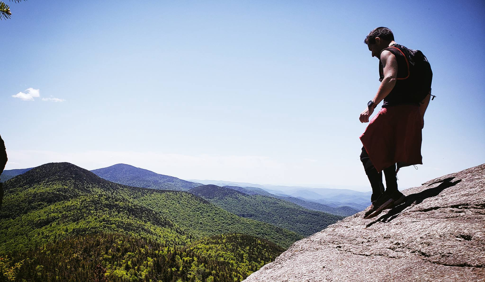
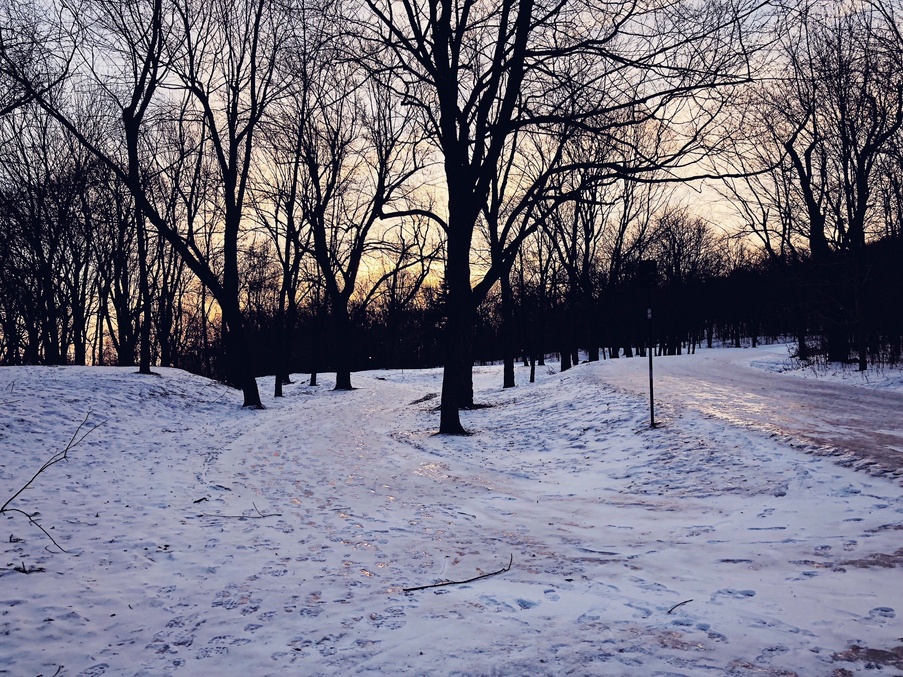

_These early months into 2020 are an interesting time to be a runner. Nine years into running, and I'm finally seeing the sport take the spotlight and the headlines: both as the sport of choice to perform, if by force, and the sport to be criticized. More specifically, it's not the sport that's being criticized, but the runners themselves._

I didn't always love running. It was 2011 when I first started running, probably still calling it jogging, as a mean to blow off steam from a job that gave me more anxiety than money. For years, running wasn't any more than just that, since a leisurely 6pm run alongside the beautiful, if windy, sunny canals of Aveiro in Portugal, was more enough to provide a good endorphin kick that my 24 year old body much needed.

Throughout the years though, running went from something that was _nice_ to do, to an _essential_. In early morning Mondays in the UK, where rain and fog made an appearance much more so than the sun, I felt the need to go out there. Running slowly didn't cut it anymore either, oh no, and all of a sudden workouts like hill sprints and intervals became routine. Before I knew it, I was calling myself a _runner_.

 
Running in Vermont, 2018

When I moved to Montreal in late 2017, my main source of anxiety was its winter. I had heard tales about it's -25 Celsius days (sometimes worse), and all I could think about was how in the world I was going to run under those temperatures. Sure enough, as we all know but often conveniently forget, progressive adaptation is a thing. Gradual colder temperatures allowed me to adapt and perform trial and error in order to tackle these frozen, winter runs with fierce bravery.

But for all these nine years, I was mostly running alone. Save for a few group runs with friends, a paired run every so often (but rarer than I'll admit), running was always a sport that I preferred alone. You're especially on your own when racing: the social aspect of racing never really came until the post-race anyway, when discussing over failed and successful strategies with fellow runners, over a gallon of water and a couple of bagels.

 
Mont Royal: our frozen mountain in the city

## Together, but alone

With COVID-19 kicking in full force and shutting down all gyms and sports facilities, running became one of the very few activities that were still allowed as they were pre-quarantine times. Dare I say, running truly remained unchanged for a while. Usually, as March comes in Montreal, it is usual to see a new wave of runners suddenly making their footsteps on the streets, as temperatures rise at last to above freezing for the first time. But March of 2020 brought more than just a wave of new runners: all former weightlifters, gym-goers, rock-climbers and CrossFit athletes started hitting the streets all at once. Some had time before the stores closed down to buy actual running gear, while others made do with sweatpants, Converse sneakers and winter sweaters. You hit the streets with whatever you have.

## No, you move!

As a runner, in these times of COVID-19, it saddens me when other runners seem oblivious to distancing measures. It also annoys me when _walkers_ aren't respectful, too, and I've seen a fairly even split from both groups when it comes to not respecting physical distance. From my perspective in this city, just as many _walkers_ seem oblivious to physical distance as _runners_. In late March, I was _this close_ to calling the police on a 10+ running group. I am highly annoyed when couples run side by side and I'm forced to quickly throw myself on the bike lane, which by the way, almost got me hit by a bike a couple of times. Luckily, the streets are emptier and traffic rush hour really isn't _a thing_ anymore, so I reclaimed back the streets.

> I've traded the mountain and the parks for the middle of the road.

As a _walker_, I want runners to be good, too. I really don't want a runner to sneak up behind me, or force me to jump away from the sidewalk to let them pass. It's a shared responsibility between us all, to take the time to assess a situation and do what's easier for both parties, and it's easier to forget that at the end of the day there's no difference between _walkers_ and _runners_. Because we're humans, we always want someone from another category to put the blame on.

## Maybe we all move

As I type this in mid-April, in Canada, I feel lucky and grateful that my sport of choice is still a possibility and a normality, even, during times when just being outside feels like both a luxury and a threat. I imagine that for the next weeks or months, I will still be annoyed at other runners who run towards me, rather than away from me. But I also know that non-runners will also trigger my anxiety when they come too close to me on a zebra-crossing, or walk in the middle of the sidewalk.

Whether on a walk around the block or a long-run along the beautiful canal in Montreal, I would like to preserve one of our last privileges, which is just _being outdoors for a wee bit_. So bring attention to people when they're too close, but perhaps do so without any trace of rage. Move away from fellow humans, but remember to raise your hand to thank them if they move first. Maybe, if you're feeling confident, smile at them, and help them remember that it is a virus that is a threat — not themselves.
