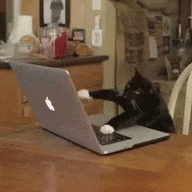
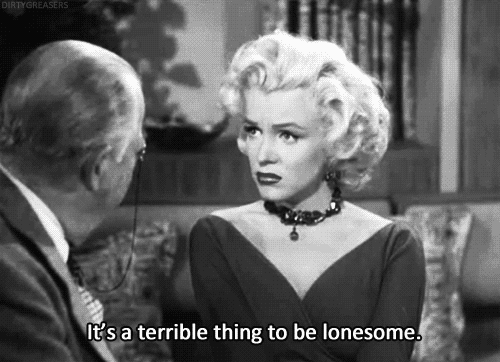
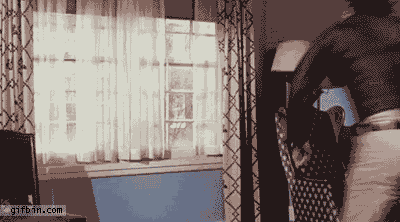

_Originally posted on_ [_my blog_](http://blog.ricardofilipe.com/post/remote-working-good-bad-ugly/) _in September 2015._

It’s now been close to a year since I started to work remotely, so I thought I’d finally gather my thoughts on the topic and share my experiences with the world. What I once saw only as a work perk quickly became a lifestyle that had, and still does, a tremendous impact on who I became to be.

#### What this article isn’t

There are already [enough](http://www.theguardian.com/money/work-blog/2014/apr/30/what-happened-to-remote-working) [articles](http://www.techrepublic.com/blog/10-things/10-good-reasons-why-working-remotely-makes-sense/) out [there](https://zapier.com/learn/the-ultimate-guide-to-remote-working/) sharing brilliant [strategies](http://www.toptal.com/freelance/how-to-work-remotely-and-still-be-the-best) on how to communicate efficiently with your team, but I couldn’t find much information on how to deal with the very first tip of the remote working string: **yourself.**

So this isn’t an article telling you _why you should go remote_, _why remote is the most awesome thing since avocado on toast\*_, or even to convince you to quit your job right now. Instead, this is a manifest of my own, confessing the highlights and the struggles I’ve had to deal with while working remotely and how I overcame some of them.

An introvert’s guide for remote working, too.

_(avocado on toast is effing epic, though)_

#### Why go remote?

After working right in the middle of London for more than a year on a very impressive Piccadilly Circus’ building, I could feel the daily commute consume me. On the very few days I did work from home life seemed easier and more manageable: more work was getting done, less stress, healthier habits. So one year ago I went looking for fully remote opportunities and was lucky enough to find a wonderful small creative team also based in London, [GatherContent](http://gathercontent.com/). Consumed by a will for a change, I made the jump.

_Above: A typical daily commute in Central London_

An what a hard journey it has been. Bittersweet, yes, but I’m not ready to give this away just yet.

#### Disclaimer: remote is remote is remote.

First of all: **no two remote workers are alike**. All of the _ultimate guides to remote working_ out there should be taken with a grain of salt, and by no means should you try to feel forced to adapt to someone else’s way of working. Different teams and individuals will undoubtedly have different needs, different working methodologies and possibly even distinct views on the concept of remote working itself.

Given the issues that remote working can present, which I’ll come up to shortly, you should first make it very clear as to why you want to do this. Answer honestly to the question first:

> “Why do I want to go remote?”

Don’t answer this for your friends, answer this one for yourself.

For some, it’s the appeal of not having a long commute. Maybe even saving money on transportation, and/or avoiding smelly creeps on the subway. For others, it’s the possibility of spending more time at home with family, working from a different location each week, or even just being able to work from bed.

Once you know the reasons why you’d like to make the jump to the remote working world, you should also make it very clear what it is you’re afraid of by making the leap. Here’s the thing:

**Remote-working becomes whatever you want it to be, but also what you let it become by itself.**

Working remotely isn’t a passive thing. Let it slide under the carpet and it easily escalates into a world of self-doubts, loneliness and guilt. Oh, I know, I’m loads of fun!

### Baby steps

When you first start to work from home, one of two things will happen: either you will so badly want to prove to yourself and your new team that you can nail this lifestyle, that you’ll end up working non-stop for half-days straight; or… you’ll find yourself becoming too distracted by your familiar environment that you won’t get any work done.

Luckily, it only takes a bit of discipline in order for the first one to happen, even though you’ll probably find yourself more exhausted than you’ve ever been when working from an office, at least in the first couple of weeks. This is okay, it’s a sign that you’re now able to achieve a sense of flow in your work, crucial to getting things done with high quality. However it also takes some responsibility not to let this withdraw your energy before it’s even 2pm.

### Achieve flow; with a balance

You’ve heard it before from other people: _“I’m so much more productive on the days I can work from home!”._ This is usually very true, I won’t argue with this. But try sustaining a 7 or 8 hour sprint of work with **no breaks in between** for more than a few days and you’ll find yourself demotivated and exhausted very quickly. When I first started working remotely, not seeing my team mates in person made me assume that everyone was working that very moment too, constantly, every, single, minute, taking no breaks.

This made me feel very guilty if I stopped working for a twenty minute break away from the computer. In an office environment, this would be the equivalent of a water cooler conversation with your colleagues, a much needed and healthy break from work mode every few hours.

#### “Hey, are you there?”

Whether you choose to work from your bedroom, a co-working space or a coffee shop, it’s incredibly important to be disciplined about knowing when to take a break. And this is surprisingly difficult when you’re working on your own; you’ll worry that by being seen as away or offline by your team on Slack will make you look like, well, a slacker! If a team mate tried to Skype call me when I was making a cup of coffee, I’d worry they’d think I had been away for hours. Uncool.

**The takeaway here is that you have to be comfortable** with whatever it is you’re doing with your working hours. If you’re not, then do whatever it takes to make this comfortable. Let your teammates know when you’re away if it helps, keep the communication going, don’t be silent, but by all means take that break and go for a walk if you have to.

And this leads me to…

### Physical and mental health

Working remotely can easily become either your **best friend or your worst enemy**when it comes to health. I can’t stress this enough, you will need a fair amount of willpower to establish good and healthy habits when you don’t have the constraints of an office space around you.

Allow me to explain this with some of my usual morning thoughts:

-   _“Why bother getting dressed when I can work from the desk right over there?”_
-   _“Screw it, today will be a lazy day.”_
-   _“It’s raining… I’ll just stay inside.”_
-   _“Hmm, nah… I’ll go out when I finish work.”_

Even the laziest of you who don’t usually work out or exercise on purpose, certainly benefit from walking maybe half an hour a day just from going from your house to the office. When your commute becomes going from your living room to the **kitchen to fetch snacks,** you may start to have a bit of a problem. Of course, this might not be a concern if you keep your usual exercise routines, but be aware that putting on your running shoes after a quiet day spent in your pajamas isn’t as easy to do as when you’re returning from a working day where you were already in motion.

Personally, the health issue made me slightly paranoid at first: I became so paranoid about not getting enough movement that I began to use step counters, schedule runs before lunch, eat a smaller lunch on the lazier days, count calories on the days I didn’t leave the house. Everything suddenly became like precise clockwork, but this also made for a very strict daily plan that killed some of the fun and unpredictability of a regular day.

**I stopped having time to read books because I was too busy making sure I got my 8000 steps a day done.**

While you certainly don’t need to count steps or calories, it helps to feel that you’re still moving. Exercise keeps you sharp, sane, and not to mention feeling fit and feeling good. The benefit of remote working is that it allows for a better management of your routines: for example, I began to insert my rock climbing sessions in the early mornings, instead of the much more chaotic late evenings. Running at 3pm? Not a problem either!

> “Peeps, does anyone need me now? If not I’m going for a quick 30 minute run, be right back”.

_A very simple and powerful Hipchat message_

As simple as that. However it took me a long time until I realised this was something I could do without any guilt — the 9 to 5 working mode that I had had for years ruined my concept of flexibility: hey, flexible working hours represent flexible _living_hours too.

While the flexibility is great, it has to come from **you wanting** to do these habits, mindfully. On the plus side, you have an opportunity to develop a great sense of health responsibility towards yourself. Taking care of your body becomes second nature; forming good habits is key while you’re on your own because suddenly you can be doing anything — and that includes doing nothing too. Red flags everywhere.

### It’s lonely out there

For me, this is the hardest part to talk about. And judging by the amount of articles I’ve been reading lately about remote working, I’m not alone on this one (how ironic, isn’t it?).

It doesn’t matter if you’re best friends or just acquaintances with the people from your office: having human interactivity is absolutely essential for a sane, normal life. Take that away and we’re paving the way to become working machines. Obviously, each one of us is a different story: you might be working from home with your significant other, or sharing a co-working space with other people around you that you might even have lunch with on Tuesdays.

If so, fantastic! However, if you’re a single guy in a huge city where all your friends live at least forty minutes away, and on top of that you’re sharing a house with an absolutely anti-social flat mate who makes you feel miserable and angry, you might be in serious trouble after a while. And guess where I’ve taken this example from…?

(SORRY ED, LIVING WITH YOU SUCKED MY HUMANITY AWAY)

However, here’s the plus side: remote working is the ultimate opportunity for you to get to know yourself and to become comfortable with your own company.

> I’ll say this again: remote working is the best opportunity you can ever have of learning how to be comfortable with and in your own company.

It will make you aware of what makes you struggle, giving you the chance to actively work upon any issue. Again, you’ll need to **want** to take care of these issues in the first place. It’s easy to get demotivated by not knowing where to start, but once you’ve established that you want to work on it, there’s no better place to start.

Remote working can be hard on us introverts because it makes our lives easier… which doesn’t necessarily translate into a better life. Embracing discomfort is a huge chunk of one’s life, while avoiding discomfort only delays a problem that will return eventually. Working from home is the perfect excuse to avoid social anxiety; but this does not mean it’s gone away. It’s just hiding.

### I forgot how to social!

I’ve dealt with this issue by becoming comfortable with unknown territory: since I could work from anywhere, I was able to visit my hometown in Portugal a bit more often without having to worry about taking vacation days. Being able to mix and match work with friends and family became a manageable and natural thing to do.

Suddenly there wasn’t anymore work-life balance, but only because this simply stopped making sense: **work is life is work**, and this is a good thing — a sane work life and a sane personal life makes the whole work-life balance a concept which means absolutely nothing. I dig this.

It also gave me the chance to venture a bit into the digital nomads’ world, which opened my eyes in ways that I would have never imagined before. Having spent a month with the [Hacker Paradise](http://www.hackerparadise.org/) peeps in Thailand this year, I suddenly found myself surrounded by a like-minded community that was bound together by work — “work” became something that was tying us together, instead of becoming a rock in our shoe that prevented us from experiencing life and enjoying each other’s company.

And honestly, I believe that both myself and my company benefited from this experience: I felt happy and adventurous, and a _happy worker is a good worker_. Knowing that I have to work hard in pursuit of my own social happiness pushes me forward and literally prevents me from sitting my lazy ass on the couch. Except maybe on a Sunday morning, but come on, Sundays are Sundays.

#### Is this even an issue?

That’s the thing about remote working. Like I’ve said at the beginning, no two people are alike. Some of my co-workers are the happiest working from their rooms every day, and the lifestyle I’m living to fight what I consider to be the downsides of RW would only make them miserable. There’s no right or wrong recipe and it’s up to you to decide, but most importantly _to discover_, what is it that’s most important for you and how you’d ideally structure your days when given the opportunity.

Remote working is all about being an efficient communicator, not only with your team or company, but also with yourself. Obviously, this is essential to any good worker, remote or not. But you can’t be a good remote worker if you fail to be both a good listener and someone who knows when and how to best speak up. The good news is that this is the good kind of challenge for a more interesting life. Just don’t hit the wall.

#### What happens next?

After almost a year, I’ve learned that for me, the London life was part of the problem — it just isn’t for me… so I’ve simply moved to Berlin a few weeks ago. Being able to perform such a huge life change over a weekend without having to part ways with my amazing team makes me eternally grateful for having had this opportunity in the first place.

It made me humble. It allows me to focus my life experiences around the people and my environment, rather than being constrained by the limitation of _an office._

Having a life driven by results instead of hours logged and timeframes makes much more sense for me these days, and this includes not only work results but life results as well. Going to meetups after work, making friends with baristas while working, choosing an exciting new place to work from each week. Yes, this adds an incredible amount of overhead to one’s daily life, but it also makes us learn how to deal with the reality of life.

If all of this sounds scary, remember that you can also work from your bed. And that’s perfectly okay too.

_Originally posted on_ [_my blog_](http://blog.ricardofilipe.com/post/remote-working-good-bad-ugly/) _in September 2015._
