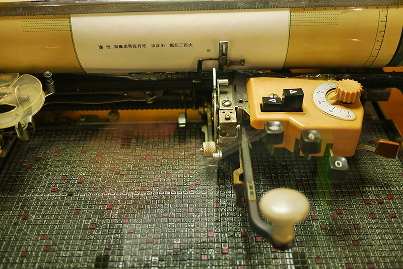
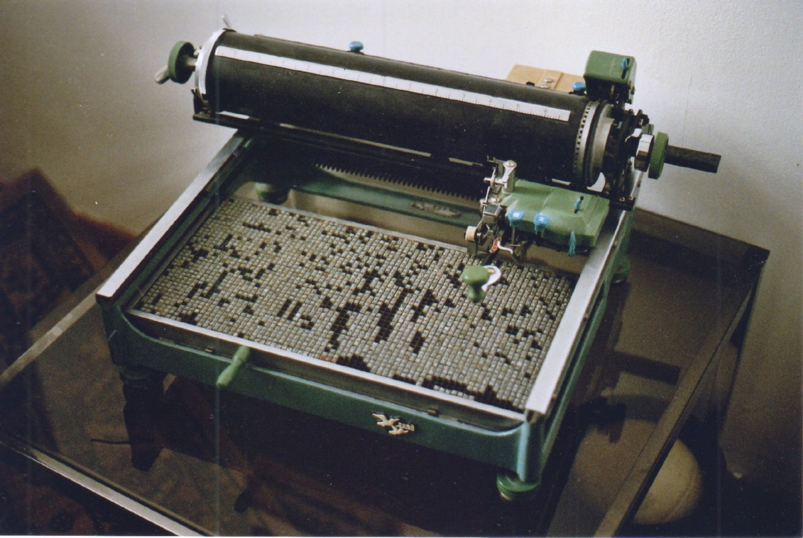
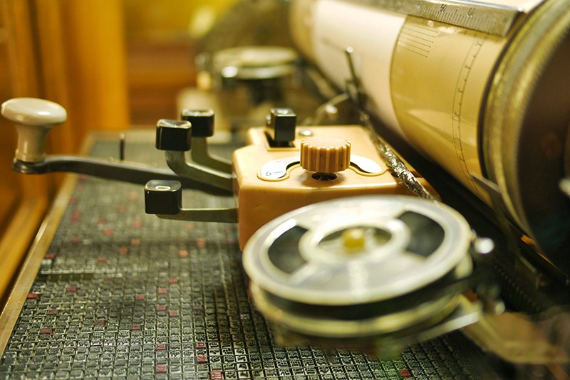

It took me 12 months and a rainy, uneventful Saturday afternoon in Berlin to finally pay a visit to the [_Deutsches Technikmuseum_](http://www.sdtb.de/English.122.0.html) (German Technical Museum). Mostly driven by the promise of seeing cool vintage cars, boats and war planes, I made my way to this enormous and almost ridiculously diverse museum completely unprepared to what would await me there. [Hint hint](https://twitter.com/magalhini/status/794967305490956289).

At arrival, some unexpectedly good news: a whole **permanent exhibition dedicated to the history of writing and printing**, and another one for the [history of paper](http://www.sdtb.de/Paper-technology.1255.0.html). As an assumed type nerd, this was Christmas and a birthday rolled up into one happy bundle. But for now, I’ll skip the details about the exhibition as a whole (even though I really want to write more about it), and focus instead on one item that instantly captured my attention, as well as my ignorance, directly from the **typewriter museum room**, which was this _old thing_:

**It’s a Chinese typewriter.**

Up until this point, I had never given any thought to this simple fact: how did typewriters work with the Chinese language, anyway?

#### **How the heck can one make a typewriter for a language with no alphabet** and dozens of thousands of characters?

Looking at this machine, the mechanics alone left me lost for words and with a complete inability to figure out how it worked. So I got home and started researching. Turns out, the history of these machines is so deep, rich and fascinating that [two books about them are in the makings](https://history.stanford.edu/people/tom-mullaney), and they don’t seem to be enough to cover it all.

#### The workings

For once, **there’s no keyboard**.

Just imagine what this means for a second, please. Here’s a typewriter with no keyboard at hand, since the idea of fitting more than 3.000 characters into a _QWERTY–like_ keyboard is as silly as it sounds. What we find instead, is a huge tray (or case) with lots of small blocks with symbols in a very snuggle fit, and by _a lot_ I mean around 2.500 of them.

Instead of typing the symbols (remember, no keyboard), the operator behind this _Chinesische Hebelscreibmaschine_ has to use a lever that literally **picks up one symbol at a time**, moves the letter up to the paper, inks it, marks it, then returns it back to the tray. If it sounds like a slow and tedious process, it really is—apparently, a good operator could type as many as 20–30 characters per minute. Again, **characters**, not words.

#### Layout and Predictive Typing

It gets more and more fascinating the more questions we begin to ask. One might wonder how to arrange the location of 2.500 individual blocks of symbols on a language that has no alphabetical order? Well, you’ve guessed it: there’s no layout order in the machine’s tray, as each typist has to memorise the symbols on her machine. However, according to an [article](http://www.latimes.com/world/asia/la-fg-chinese-typewriter-snap-story.html) about these technological wonders from L.A. Times, some typists **pre-arranged their layouts** based on the purposes and the field of work it was meant to be used:

> Typists started reorganizing their trays to suit their needs. One who worked in an office dealing with agriculture might put characters used to make words such as “farm,” “crops” and “harvest” near the top of the tray because those words were used frequently; a typist in a police station would have a totally different arrangement, with characters used in words such as “officer,” and “crime” close at hand.

This would be the equivalent of you arriving at your workplace and finding your laptop keyboard layout completely rearranged, only at a scale of about 96 times worse. Some typists simply arranged the blocks of characters based on their appearance frequency.

#### Evolution and technological lateral thinking

It’s worth noting that all these overwhelming limitations didn’t prevent its technology from developing remarkably fast. The **Mingkwai**, in the 1940’s, had 72 keys available which could print up to 90.000 characters, at a higher character-per-minute rate. To achieve this, its architects took advantage of the logistics of the Chinese language and baked it into its mechanics, splitting up the full characters (around 7.000) from the partial characters (1.400).

Using two separate buttons, the typist would now be able to pick two symbols from this huge lineup of images, and a magnifying glass enables her to preview the finished symbol, just before the levers would go about their business of picking up the metal casts for the printing/inking process.

Moreover, these trays of metal casts were **easily extensible** as well, meaning that the typewriter could be extended with different trays for foreign characters, usually English or Russian ones.

> “With the Chinese typewriter, there was a constant process of optimization, and some of the most brilliant and penetrating analysis of human-machine interaction, data structuring. “This is a machine whose history is a repository of design inspiration.”

#### So where were these incredible machines?

Now begins the also fascinating history side of things. Chinese typewriters were incredibly expensive to make (which made them also incredibly expensive to purchase), so they’re very rare. Very few Chinese have ever laid eyes on one, even. Typewriters were simply not common objects in China, not only because of their forbidden price but also because since the Communist era began, they were literally forbidden objects to own. Since then they became controlled objects and had to be registered and licensed by the police, so it’s very unlikely that any hopeful fiction writer ever wrote his or her novel at home on one of these. With a weight ranging from 15 to 40kg, they were also not exactly portable either.

<Embed src="https://www.youtube.com/embed/M77DxXRI014?feature=oembed" aspectRatio={undefined} caption="" />

#### United by a fantastic problem to solve

The machine you see in my pictures is dated from 1975, but research seems to suggest that a lot of work has been made into solving this megalomaniac problem since the early 19th century:

> Starting in the late 1800s, various systems were pioneered — and a lot of the work was done by students and academics from American institutions, including MIT and New York University. Companies such as IBM and agencies including the CIA also worked on developing Chinese typewriters.

From my research, the fact that the main driving force for the Chinese typewriting development came from North America may have come from **Hou-Kun Chow**, a Shanghai-born engineer who’s credited for the first prototype of such a machine. In 1916, Hou-Kun was studying at MIT when he began wondering about the practicality of a typewriter for his language, himself admitting that a _one-key-one-character_ solution was just beyond impossible. Once again, like major achievements in our technological history, the best solutions to a problem came from lateral-thinking due to a problem’s innate limitations.

#### The beginning of predictive writing

It’s no wonder that the wonder around these incredible machines is gaining traction, fast. Mostly, this is due to one man’s obsession over them. **Tom Mullaney** is a Stanford University professor who’s dedicating a huge chunk of his time to studying their history, and you can find his work scattered [around the Web](http://news.stanford.edu/news/2012/november/chinese-typewriter-historian-112812.html). He also owns his own small collection of Chinese and Japanese typewriters, which means he probably owns the largest percentage of them in the world.

One of the most interesting insights about these typewriters is the fact that in a way they represented the very beginnings of our now industry-standard _predictive typing_. Mullaney himself [wrote extensibly](http://news.stanford.edu/news/2012/november/chinese-typewriter-historian-112812.html) about this, arguing that the character arrangements on these machines have allowed for a prediction of what was to come in China’s sociopolitically environment. As an example, in the 1930s pre-communist era, the key character **_Mao_** gained a central position in the character layout since the **Chairman Mao** had taken power.

> “This meant that Zhang would reorganize his characters every time a new political campaign started up. During the Korean War, for instance, Zhang would prepare phrases like “Resist America, Aid Korea.” When the government was emphasizing worker efficiency, he might prepare the character combinations for “production” and “labor.”

More than the artefact itself, it’s the beauty of the pursuit of a solution to a seemingly impossible problem that’s truly fascinating. These relentless efforts ultimately shape the upcoming designs that follow, and that was exactly the case with decades of research and trial and error. As Mullaney has put it on that same interview for the L.A. Times,

> “The Western typewriter has become a cult object; there are hundreds upon hundreds of collectors and museums. People collect and fetishize them,” professor Tom Mullaney said. “But Chinese typewriters are exquisite machines. They are very different. They are typewriters without a keyboard, and that often confounds peoples’ imaginations.”

---

As for the [_Deutsches Technikmuseum_](http://www.sdtb.de/English.122.0.html)_,_ I am most definitely coming back for more, as my visit was certainly rushed. The printing room also holds a couple of [Linotype machines](https://en.wikipedia.org/wiki/Linotype_machine), as well as a ton of other press related machine work that also deserves attention. The only problem is that unlike the rest of the museum, both the printing and the paper-history rooms don’t have English translations… I am guessing they’re not as popular as the rest of the museum, which is such a pity. Next time, I’ll be armed with a better German vocabulary... and more battery on my phone so I can use Google Translate. You know, just in case.

Watch this space.

---

_If you’re interested in all-things-type, you may be interested in the bi-weekly newsletter I curate,_ [**_Coffee Table Typography_**](http://ricardofilipe.com/coffeetabletype)_._
