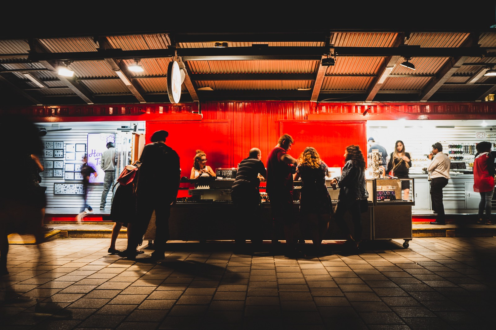
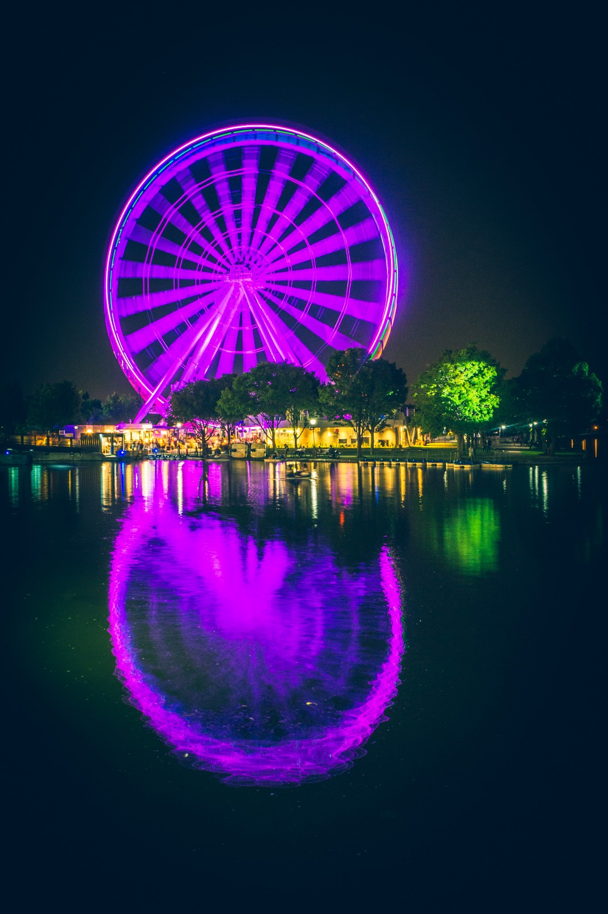
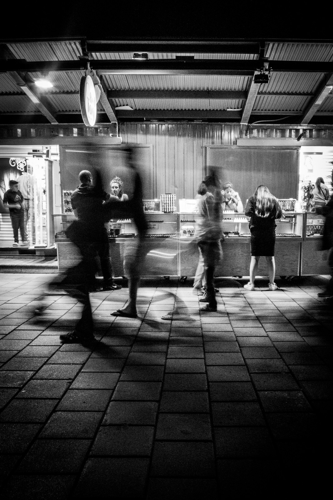

It’s Saturday night, but it could very well be any other day of the week. It usually happens during the Summer, as the streets are always more crowded and bustling with life — ah, the life of others I know too well. Carrying my camera is my green card to go out into the heart of the city by myself, even on the nights it never ends up leaving the messenger bag. It acts as my hidden permission slip for solitude, on nights like these.

There’s a Murakami book in the messenger bag too, and two lenses I’m not very likely to use. Heading into the _Vieux-Port_ area  of Montreal at 9pm on a Saturday isn’t typically my idea of a fun night, fighting against the swarm of tourists and 20 year-olds finding the next cheap bar to hop into. But as soon as my camera is out of the bag, that’s exactly what I find myself craving. Crowds, faces, anonimity, dodging bodies. It’s not a new feeling, this one. It’s a feeling of solitude I know too damn well, one that’s been haunting me for so long, and since so far away. Some unshakeable baggage, if you will, that’s been following me around.

It’s a warm night, and walking for so long under the humid Montreal nights turns my body into butter. All of my high-endurance athletic capabilities seem to fade away and my body turns into a morbidly obese one, but I keep pushing it through the crowds. The sounds of a hustling city don’t differ too much from other cities elsewhere. Laughter, the occasional scream, camera shutters and footsteps, lots of footsteps, they’re pretty much the same flavour everywhere, but there’s some comfort in knowing this is so.

There’s an old woman who seems lost and confused. I can’t be sure, but I stop for a while. She’s not moving much, but her eyes and her head are restless. On my camera, I quickly drop a few _f-stops_, lock the exposure on her, and steal a shot of her restleness.

She sits down, that somehow makes me feel more reassured.

There are couples kissing, also sitting on the pavement. _I wish I were one of them._ The camera is in my hands now, and I shoot the skyline of the city however best I can. I tend to delete the pictures as I go; part of me never grew out of the 35mm film mindset, so I don’t shoot a lot. Shoot shoot shoot, delete delete.

I walk through the park at _Champs-de-Mars_, and as always, it seems as if I’m the only single party in sight. I can’t help but to look and contemplate other groups, of 3, 4 or 6 people. _I wish I was one of them_. Turns out, a change of lens is in order; a prime lens is better suited for the skyline lights that blink ahead in the horizon. The moon is a beautifully shiny First Quarter, which happens just after a New Moon. The First Quarter phase usually only lasts for a night, and in the following days it will turn into a Waxing Gibbous.

I’ve shot the moon a lot, so inevitably flashbacks zap through my mind. This feeling I know too well, from Summer nights in Berlin just a year ago where I was walking around a lively Kreuzberg, camera in hand, listening to the sounds of the city. There was a different kind of action there, as life tended to stay in just one place for a very long time. A patch of grass, a pipe above the canal, a couple of boulders by the _Landwherkanal_. Groups of hippie-hipsters playing guitar, and myself wishing _I were one of them_.

When the pedestrian lights turn green, I don’t hesitate for even 100 milliseconds before marching forward. Not even looking. The world around me needs to know I’m not hesitant, no, I’m confidently walking towards my destination. Someone’s waiting for me. But I’m not. And nobody is.

I reach the very colourful ferris-wheel of the _Vieux-Port_, faced with families and couples strolling along the waterfront without any real destination. We got that in common, at least, though I begin to feel ashamed for sharing only the company of my trusted camera, which by now already runs hot from all those long exposure shots of the wheel.

> “I’m here to make art, people, nothing to see here. See, camera, art, that’s me. Doing my thing. Thanks, move along.”

I replay these invented dialogues in my mind, and I even lose all the arguments I make up in my own mind. _“You mean Instagram-art, poser!”_, some replied back in my imagination. _“Damn it, you’re right, stranger”_, I’d think. My feelings of shame towards my own voluntary solitude only grow stronger, beginning to hope I’d stumble upon someone I know. I wouldn’t even need to like whoever I’d see — just someone, please, a familiar face is enough. By the clock tower, hands already touching 11pm, I think I recognise a friend for a few seconds, and my heart beats a little bit faster. I’m wrong of course — I should have worn my glasses tonight so I could see shit. The thoughts then turn to that person whom I thought I’d just seen, once again, finding myself _wishing I was with them._

> “Excuse me, can you take our photo?”

A family of 3 asks me. I smile, put my own camera away and take 4 shots of them with the water in the background. The third one looked especially bright, they’re gonna like it for sure. Where are they going to next?

I know I’m feeling particularly ashamed of my solitude when my camera settings are set to a slower shutter speed. It’s as if the mood of my heart can be measured in _f-stops_. I begin to shoot long exposures of strangers walking by, making them faceless, turning them into ghosts except for the ones standing still. I’m standing still, I have to — but maybe I’m the real ghost in this scenario. If only someone would stop, for a little while. And the ones walking, oh, _how I wish I were one of them_.

_“I want to be a faceless moving ghost in someone else’s camera”_ — this crosses my mind. It sounds so dramatic, something my 17 year-old self would say. I can’t help but to find it funny.

Hopping on the orange line towards Montmorency, now past midnight, I finally reach for the Murakami book in the messenger bag. It’s _Men Without Women_, and there’s only enough time to read maybe 6 pages before hopping off again. One of those paragraphs describes the city life in Kyoto, and for a few moments I find myself wishing _I were there_. Just like tonight and my previous lives, it wouldn’t make that much of a difference. I picture myself in Kyoto, camera out in my hands. Same feelings, same sounds — just different ghosts. And I’m totally at peace with that thought.

---

_(All photos taken that night)_
