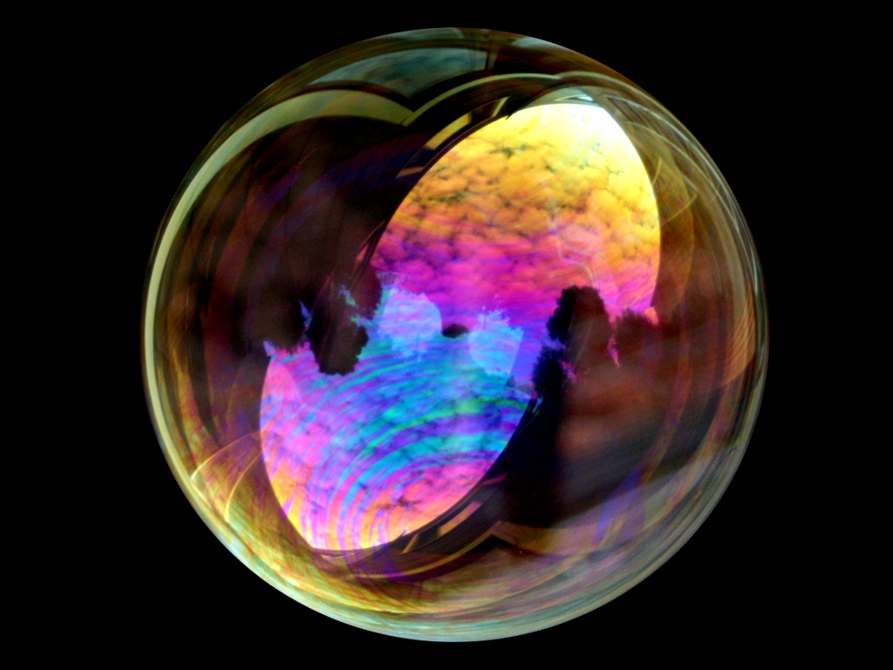

_Disclaimer_: it’s officially a waste of time reading and researching more and more articles about the complexity of the human being, the seven personalities types or the quirks of the human brain, really.

#### There are two, and two only kinds of people: the ones who like bubbles and the ones who don’t like bubbles.

A couple of months prior to writing these words, me and a very good [friend](https://twitter.com/gnclmorais) went to a popular [Design conference](http://designandbanter.com/) in London. That evening, they were celebrating one year of talks with a party: that meant lots of food, cheap plastic toys, beer. Just like any other sponsored low cost party for a bunch of people gathered in a rather small co-working space.

Some of these toys they were giving away included tubes of blowing soap bubbles; you remember those, right? The way most of us acted like properly mental kids every time we got the chance to show our friends that we could make bigger, longer lasting soap bubbles than any of them! We’d steal the dish washer liquid from our kitchen and refill that container until it was all gone.

That evening, after the party ended, we grabbed a couple of those. Which we took with us as we were heading home. Enter the London underground.

For those unfamiliar with the London underground, all you need to know is this: **it’s miserable**. Unhappy, miserable, sad faces that silently scream _“don’t make eye contact with me, you disease-carrying-murder-prone-stranger”_ populate those carriages daily, capable of sucking the darkness back from any Black Hole somewhere in our galaxy.

So what happens when a couple of _I-don’t-give-a-fuck-about-anything-tonight-just-went-to-an-awesome-party_ dudes enter those trains, blowing bubbles into the shallow depths of those carriages?

Well, that was the interesting bit.

Many of those faces lightened up, with the power of a million watts. Groups of young people, old people, children, people dressed like [zebras and lions](http://www.rumpusparty.co.uk/galleries) (I’m telling the truth, oddly enough, welcome to London!), so many of those faces shared at the very least a friendly smile. Some of them were actually took their attention away from their iPhone games, I kid you not.

Kids went ballistic. Some parents were concerned about them interacting with a couple of weirdos blowing bubbles on the tube; their kids paid no attention to them, rightfully. They were having fun poking those bubbles away, as any 8 year old should do.

Girls went crazy: we were making an active effort to keep up with popular demand. We couldn’t make enough of them for the amount of poking that was going on! And here, I intend no pun.

**Meanwhile**, some people were effectively annoyed.

I remember spotting a woman that pretended to get a bubble into her eye, so she could have a “genuine” reason to complain about these two idiots who should have remained in their country to begin with! How dared we, blowing bubbles in the tube to entertain people at 11pm.

Being generally shy, it took me a while to blow these suckers away like it was 1999. And every time I did, I noticed how some people avoided all kinds of eye contact with me. They were scared; were we drunk? Hmm, hard to tell. A couple of women walked away to the other side of the carriage, nodding their heads.

A 20_\-ish_ year old vigorously shook the bubbles away, rolling his eyes every time. I kept blowing them in his direction.

It was amazing to notice how people became so enclosed in a routine where anything out of the ordinary is something to be avoided. Meanwhile, the other half was having the time of their lives — we even gave the containers away to a couple of kids who immediately began to blow the bubbles away as soon as they stepped out of the train.

Now, that’s happiness if you ask me. Accepting the quirks of a world that has so much to offer when it doesn’t make much sense.

### If you can’t be happy when there are soap bubbles flying around, you’re going to have a bad time throughout life.

_— When you see bubbles, immediately begin the poking frenzy at your own will._
