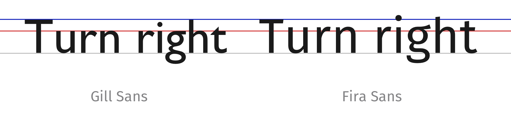
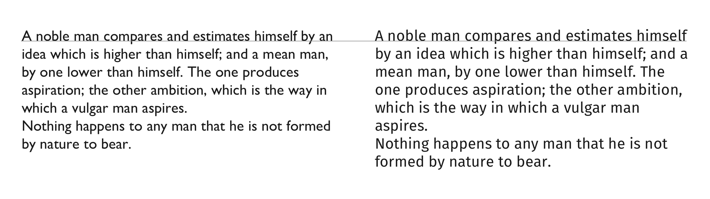
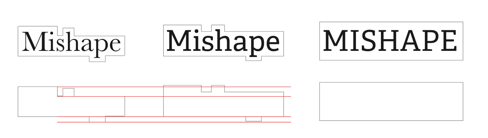
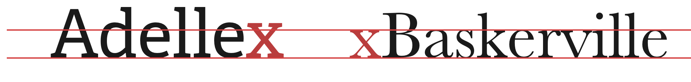
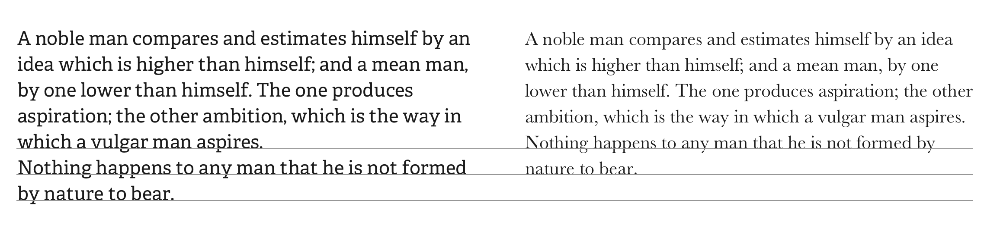
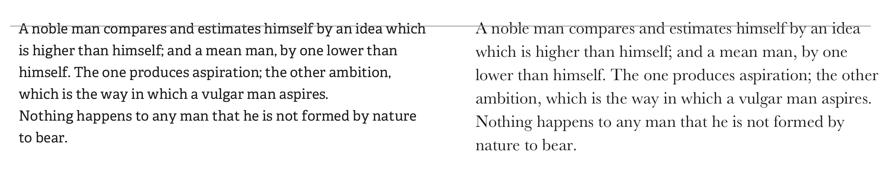
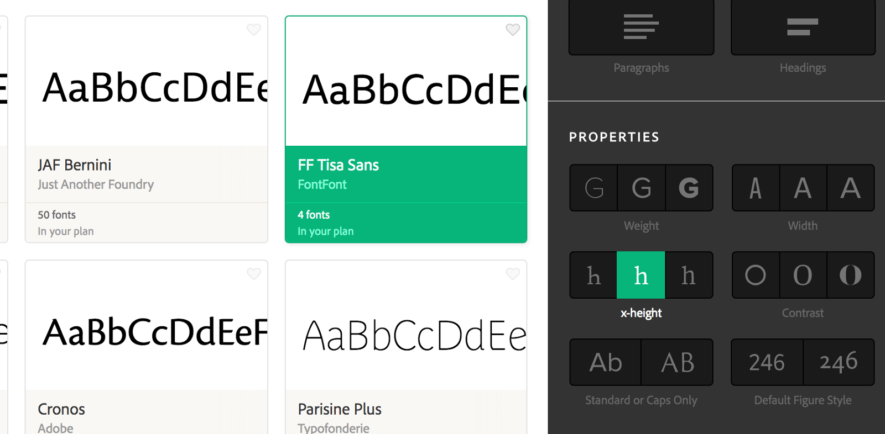

_It barely matters how many_ [_books on typography_](https://medium.com/p/8-books-to-learn-typography-from-word-lovers-to-type-setters-to-writers-6c1f3d9744a4?source=user_popover) _I’ve read and will read: I struggle just as much as anyone else when it comes to finding a good typeface for a particular project. The message, the mood and the context, they all play equal parts in the decision in finding the right typeface for the job._

There is however, an often overlooked aspect that I’d like to make a good case for the next time you’re hunting for _the one_ typeface, and that is to learn how to **assess its x-height impact on readability and legibility**. Over the years I’ve been learning how to pay more and more importance to it, and here’s why you’ll maybe want to understand it better a bit too.

#### What is x-height?

The x-height is literally what it means: the height of a lowercase _x_ character for a particular typeface, measured from its baseline. This height should be seen as a relative unit for measuring the proportion of the lowercase letters: the height measurement alone, as a unit, doesn’t tell us much.

#### Why does it matter?

You may have or may have not noticed that x-height varies a lot amongst typefaces (example a couple of paragraphs below). Now consider that you are reading this piece of text in lowercase letters: this paragraph isn’t a street or a highway sign to be read in 0.2 seconds, but a continuous flow of words which were carefully put together on a medium that respects this context. Different contexts or purposes call for different readability and legibility choices, and x-height has a bigger impact on both of these than, perhaps, the choice between going serif or sans-serif.

#### So, large or small x-height?

Here’s the interesting (though often frustrating) bit: you’ll find references among different knowledge sources stating that sometimes, a larger x-height is a better option for a legible piece of text, and others, a smaller one is the best. So where do we stand? The first thing to note is that yes, a larger x-height certainly gives the appearance of having better legibility. But that’s not the entire story!

Let’s look at two popular sans-serif typefaces, **Gill Sans** and **Fira Sans,** put together:

Pay attention to the middle red line, aligned with _Gill Sans_’ x-height. Notice how _Fira Sans_ exceeds it? **It has a larger x-height**, and there are two important aspects to make a note of here:

-   They are both set at the same screen size of 50px;
-   It just happens that they have the same **cap height** (that’s the height of the capital, shown as the blue line).

At such a big display size, and so few characters being shown and on a single sentence, _Fira Sans_ would arguably win the legibility test. _But bigger isn’t always better._ Let’s compare these typefaces, still set at the same size but this time on a full paragraph, with their baselines aligned:

Skipping for now the fact that _Fira Sans_ on the right takes **more real-estate space** than _Gill Sans_ at the same type size and line height, I invite you to read these two paragraphs and pay attention to the amount of effort you’re doing to recognise the shapes of the letters are you read. It seems, in this case, that a smaller x-height **also increases the perceived space / size of the ascenders and descenders.** The opposite of this tends to  make the lowercase letters less distinguishable from the capitalised ones. This messes up with the overall box-shape of the line form and makes it harder for our eyes to recognise the different shapes. Recognising these shapes is a key part of the process on [how we read](https://alistapart.com/article/how-we-read).

If you’ve ever wondered what makes all caps text hard to read, let’s look at word shapes and try to find a clue:

Naturally, all of this happens too with serifed typefaces:

Which one would you prefer for larger amounts of text in a paragraph? This is a good example of how a smaller x-height can score higher on the legibility scale. Naturally, **font contrast** also plays a key role in this example (which is a topic for another article), but bear that in mind for the following example:

It’s a fact that **larger x-heights will make text more visible**, but always consider what impact the overall shape has on the overall shape of the text. In the example above, _Adelle_ is [clearly screaming for more space](https://media2.giphy.com/media/EFpLaxWuwlx7O/giphy.gif?response_id=59235360ab6d03fa9f49b5f4) in her life.

For experimentation’ sake, let’s now readjust _Adelle_ on the left to match _Baskerville’s_ x-height. This means decreasing its point size from 22 to 18px, and giving it a smaller line height to match its now smaller type size. And now let’s compare them again side by side:

This now feels much better, but after a whopping downsize of 4 pixels in size. The choice between the two could now be made depending on its medium: typically, [text for the screen benefits from a larger x-height](http://webstyleguide.com/wsg2/type/face.html), while paper with its shorter reading distances, can benefit from a lower one. Again, not a hard rule, but something to keep in mind.

### What’s the takeaway from all this?

_Grains of salt._ The main takeaway is that you shouldn’t treat typography as a fixed set of rules without considering its context first. A larger x-height might not make your text more legible despite what some literature might say, so don’t follow it by the book. Pay attention to the space the typeface needs to breathe, and adjust type sizes and line height accordingly.

#### Choosing typefaces

If you own a subscription for [**Typekit**](https://typekit.com/fonts?filters=cl:ss,xh:r), you can already search through their typeface collection sorted by different x-heights. Here’s a screenshot of their current filter:

Next time you’re choosing a typeface, try to pay attention to x-height and don’t settle for a fixed size until you actually choose the fonts to use, since this will dictate how they look and feel on the screen (or paper). And stop sweating about the sans-serif vs. serif debate, since this is something that doesn’t really impact readability.

And if you’re trying to pair typefaces, another struggle in the typography world, keep in mind that [**mixing typefaces with similar x-heights**](https://designshack.net/articles/typography/mixing-typefaces-tips-and-techniques/) usually creates a sense of harmony between them.

> If you’re interested in well curated news about typography (and coffee), I invite you to subscribe to my [**Coffee Table Typography newsletter**](http://ricardofilipe.com/coffeetabletype/). It goes out twice a week, no ads, no selling, just the sheer passion of type delivered from me to you.

Happy typing! ✍️ Any suggestions, [ping me on Twitter](https://twitter.com/magalhini) or leave a comment.
