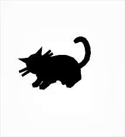
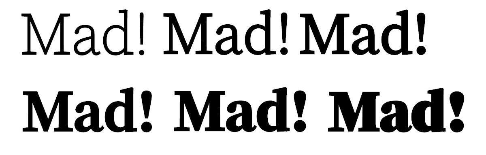
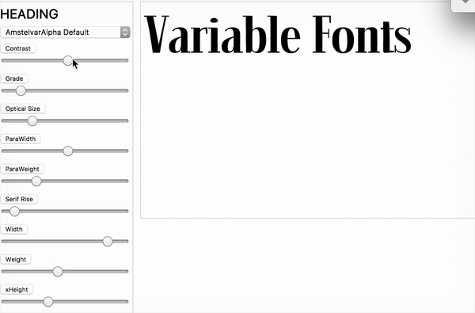
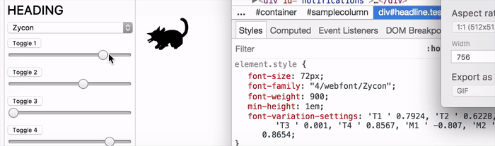

## A lot has been written about variable fonts ever since they were introduced with the new OpenType 1.8 specification late last year. But from a practical point of view, for web designers and developers, what can we expect?


**Variable Fonts** are still in active development, and the [CSS Fonts Module 4](https://www.w3.org/TR/css-fonts-4/) spec fully embraces them as the future of typography on the Web. And yet, there is still some uncertainty about how they’ll work and how developers will be able to control them;

_“Are they for designers to play with, or developers? Do they work like SVG? Is there a new @font-face property coming?”_

I could write endlessly about the how and why VF (variable fonts) work, but in this article I’ll focus on what they mean for web developers, and how you can try them out today ahead of time.

VF allow font designers to include unlimited weight, style, and other variations in a single font file. But first, as with everything else on the Internet (and my life), I’m making the case for my point with… _cats_ 🐈 Namely, an animated vector kitten in the browser:



_A vector cat glyph, animated, without SVG or JavaScript?_ We’ll get to this example later, to fully understand what’s going on. Let’s first understand how variable fonts work.

#### Quick introduction to Variable Fonts

Variable Fonts (or, officially, _Open Type Font Variations_) consist of a new format that can be used to deliver fonts to the browser. The difference, compared to the standard today, is that instead of using multiple files for different variations (one file for _Regular_, another for _Bold_, another for _Italic_, and so on), **a single file contains all the specifications** needed to produce all these variations… and then some. You can think of them as an (almost) organic, morphing set of shapes that can be dynamically controlled.

The most obvious benefit, from a technical perspective at least, is performance in their delivery: instead of serving 6 different font files for 6 different styles, for example, a single request for a variable font file is enough to produce all the variations you can think of.

The magical powers of Variable Fonts isn’t in their interpolation ability alone, but how it happens. [John Hudson](https://medium.com/@tiro/https-medium-com-tiro-introducing-opentype-variable-fonts-12ba6cd2369) has explained it clearly:

> An OpenType variable font contains one or more axes that each provide particular variation between different extremes of a typeface design. The format also allows for the possibility of intermediate designs, for the whole glyph set or for individual glyphs, to provide finer control over the design as it changes across the variations design space.

#### Wait… isn’t value interpolation a type crime for a font’s features?

A very legitimate question! 👏

Careless computer calculated interpolation could be an absolute type crime, since it would destroy the features of a given font’s features (e.g., the serifs won’t grow in contrast at the same rate as other features of a glyph, etc). This is where the pre-defined axes come in: the interpolation is controlled, and so a glyph changes only how the font designer wants it to.

Let’s look at an example, coming from the experimental typeface **Adobe Variant Font Prototype**. Here’s how these 4 _“Mad!”_ glyphs change in shape, when we set their `font-weight` property to values between 1 and 999:



Notice how no glyph’s features look out of place. The exclamation mark grows in contrast and character, and pay attention to how the **_a_** terminal remains consistent even though the overall contrast increase was quite significant.

#### How do they work?

There’s a lot of detail to go into, which you can learn about from people who know a lot more about it than I do, [here](https://medium.com/@tiro/https-medium-com-tiro-introducing-opentype-variable-fonts-12ba6cd2369) and [here](http://www.alphabettes.org/responsive-variable-fonts/). In a nutshell, these _organic shapes_ aren’t just expanding/collapsing in an uncontrolled fashion. Instead, these fonts have 2 (or more) axes defined, typically, **weight** and **height**, which can be manipulated separately via CSS to achieve different styles. We’ll see examples below, but I highly recommend reading [this gentle and visual introduction](https://www.typenetwork.com/brochure/opentype-variable-fonts-moving-right-along/) TypeNetwork have written about how axes work in AmstelVar.

At its Github repo documentation, there’s a paragraph that brilliantly describes how the interpolation happens per axis:

> The Weight axis of Amstelvar is parametric, or the progress of darkening and lightening only effects those parts, and as much as possible does not effect other parts, particularly the white space. So as Amstelvar gets bolder or lighter on the weight axis, the internal white spaces of the letters remain consistent, leaving their control to the width axis. This is also the only current Amstelvar axis that uses two styles, one thinner than the regular and one bolder than the regular.

#### So as a Web Developer, how can I control them? Is it like SVG?

Enough theory, for now! Let’s get practical. I was surprised to see how familiar controlling variable fonts feels to those of us already used to controlling typography in the Web. All these definitions are currently being being drafted in the [CSS Fonts Module Level 4](https://drafts.csswg.org/css-fonts-4/), and a couple of them are already familiar to you, **font-weight** and **font-style**, though they get new properties too.

For example, CSS4 specifies that `font-weight` will receive values from 1 to 999, but in increments of **1, instead of multiples of 100**.

`font-style` will take a slanted angle, which can range from -90`deg` to 90 `deg` .

Another property, `font-stretch` , can either [receive a string value](https://drafts.csswg.org/css-fonts-4/#font-stretch-prop) (_condensed_, _semi-expanded_, _normal_, etc) or a **percentage value**, from 0 to 100%. _(_[_Dominik Röttsche_](https://twitter.com/abrax5) _pointed out that fractional percentages are also accepted)_

For now, though, all the examples you’ll find will most likely only tweak the `font-variation-settings` property in CSS.

#### Endless axes for variations via OpenType

More properties and variations, on some more complete typefaces, can also be controlled via OpenTypes features, with the already available `font-variation-settings` property. With each parameter being defined by the font designer, their variation possibilities are almost endless. A font can have its own set of four character tag that can be used to control a very specific variation.



And here’s the CSS example for Amstelvar Alpha, which supports granular control for **contrast** `cntr`, **Grade** `grad` , **Optical Size** `opsz` , **Serif Rise** `srfr,` **Width** `wdth,` and **x-Height** `xhgt` :

```
p {
  font-variation-settings: 
    'cntr' 99.9998, 
    'grad' 176, 
    'opsz' 13.999, 
    'srfr' 34.998, 
    'wdth' 803.999, 
    'wght' 175.98, 
    'xhgt' 999.988;
}
```

_(On a side note, if you haven’t dug deep into what OpenType features can offer you today,_ [_I’ve made this demo late last year_](http://open-type.surge.sh/) _with all the features that you may be missing out on.)_

#### Are developers supposed to define where one style ends and the other begins?

Not necessarily so, luckily, as that would induce plenty of choice paralysis. Imagine if it were always up to each developer to decide where “Bold” ends and “Extra Bold” begins?

These fonts can have something called **named instances**, which you can think of as being sort of breakpoints that define where each style and weight starts and ends, as defined by the type designer. That means that if you don’t care for the interpolation, you can still use the tagged _Regular_, _Bold_ _Italic_, and so on in your CSS.

#### So, back to that cat example…

The initial example of the cat glyph, moving up and down, is a great example of how Variable Fonts can be used creatively, being a wonderful showcase of their flexibility. They can also add so much power to our already enriched toolset of web animation, for example. That example uses the [**Zycon**](https://www.youtube.com/watch?v=O7V7nq5eGb4) typeface (also available to play around with on [axis-praxis.org](http://www.axis-praxis.org/)). Wingdings, with axes.

The font designer has added 6 different axes to _Zycon_: 4 _toggles_ and 2 _motions_. Two of them, `toggle1` and `toggle2` happen to be applied to the cat glyph, which we can manipulate to make it… _twerk_. Here’s all of it in action:



Every glyph can have its own set of axes defined by the font designer. This can make up for gorgeous, lightweight, customisable and animatable icon/illustrations set in the browser, for instance. Can you imagine what type specimens might look like in the future? 👌

#### Loading the Font files

Once again, there’s no breaking changes with regards to how the font files are included and served to the browser. Variable Fonts can be served just like any other OpenType `font-face` file, the difference being in the `format` specified, like so:

```
@font-face {
  font-family: ‘Amstervar’; 
  src: url(‘Amstervar_VF.woff2’) format(‘woff-variations’); 
  src: url(‘Amstervar_REGULAR.woff2’) format(‘woff2’); font-weight: 400;
}
```

Also notice how a normal font file can be served as a fallback, in case variable fonts aren’t supported. In order for the format to be used, format needs to be set to either `woff-variations` or `ttf-variations.`

Here’s [CSSWG](https://drafts.csswg.org/css-fonts-4/#src-desc) on the new `formats` :

> A value of “woff-variations”, “truetype-variations”, “opentype-variations”, or “woff2-variations” imply support of the “woff”, “truetype”, “opentype”, or “woff2” formats respectively along with additional support for font variations. Web authors can specify this format to indicate that variation support is required for correct rendering of a font. This mechanism can be used for gracefully falling back to an ancillary font when variation support is not present.

#### What about browser support?

At the moment of writing, it seems no default browser supports Variable Fonts directly, but you can still try them out using the [Nightly versions](https://developer.apple.com/safari/technology-preview/) of Webkit, or by downloading [Chrome Canary](https://www.google.com/chrome/browser/canary.html) and enabling some feature flags. Firefox seems to already have support for them using the [Developer Editions](https://www.mozilla.org/firefox/channel/desktop/), too. There’s a lot more information on [how to get started on axis-praxis](http://www.axis-praxis.org/blog/2017-04-05/17/how-to-get-variable-fonts-working-in-safari-chrome-and-firefox-macos), but the _tl;dr_ is:

1.  Download Chrome Canary
2.  Head to **chrome://flags**
3.  Enable “Experimental Web Platform Features”
4.  Download [AmstelVar playground Github repo](https://github.com/TypeNetwork/fb-Amstelvar) and have your mind blown away 👌

#### Conclusion

Despite Variable Fonts not being quite ready for production use yet, there’s no reason not to keep up with its developments during these early stages. The most optimistic prediction stipulates that they’ll gain massive browser support in mid-2018, so there’s a pretty good chance they’ll explode in usage right from day one, just like CSS Grid did a few months ago.

Their possibilities are endless; from granular text control, to [distance-based contrast interpolation](https://vimeo.com/178954414), or [environment-based control for type](https://twitter.com/_/status/837037624003031040), the creative realm certainly gains a huge array of possibilities with this technology. But it’s our responsibility, as designers and developers, to fully understand the extent at which they can (and should) be controlled.

#### Resources

-   [Microsoft’s Overview of Variable Fonts functionality](https://www.microsoft.com/typography/otspec180/otvaroverview.htm)
-   [Nick Sherman’s Twitter Collection of VF resources](https://twitter.com/variablefonts)
-   [Amstelvar Font Breakdown](https://www.typenetwork.com/brochure/opentype-variable-fonts-moving-right-along/)
-   [Amstelvar Github demo](https://github.com/TypeNetwork/fb-Amstelvar)
-   [Axis Praxis Variable Font Playground](http://www.axis-praxis.org/)
-   [RWD Podcast with Tim Brown/Bram Stein on VF](https://responsivewebdesign.com/podcast/variable-fonts/)

Before you go,

_If you’re interested in well curated news about typography (and coffee), I invite you to subscribe to my_ [_Coffee Table Typography newsletter_](http://ricardofilipe.com/coffeetabletype/)_. It goes out twice a week, no ads, no selling, just the sheer passion of type delivered from me to you._
